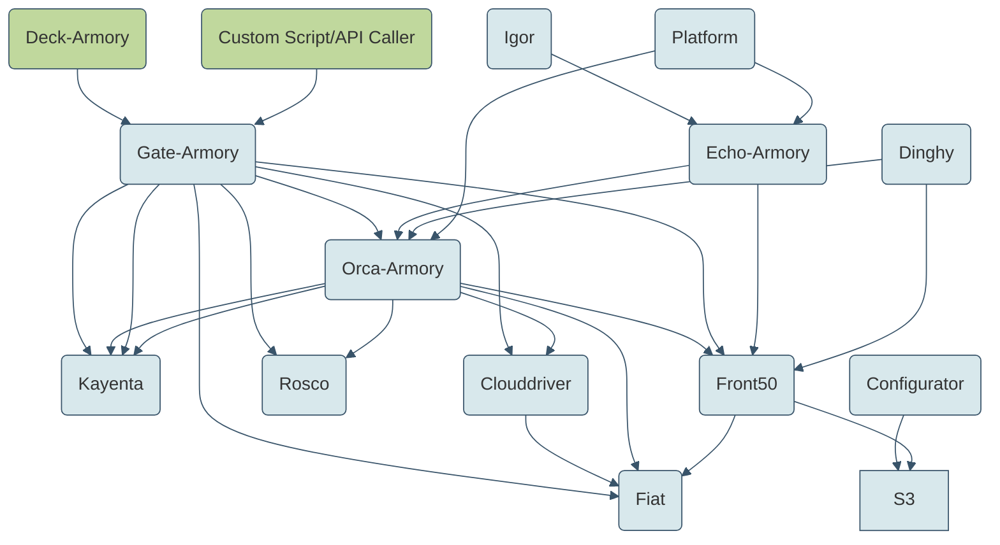

Support for Mermaid diagrams is included in the Docsy theme. https://www.docsy.dev/docs/adding-content/lookandfeel/#diagrams-with-mermaid

```mermaid
 graph TB

	 deck(Deck-Armory) --> gate;
	 api(Custom Script/API Caller) --> gate(Gate);
	 gate(Gate-Armory) --> kayenta(Kayenta);
	 orca(Orca-Armory) --> kayenta(Kayenta);
	 gate --> orca;
	 gate --> clouddriver(Clouddriver);
	 orca --> clouddriver;
	 gate --> rosco(Rosco);
	 orca --> front50;
	 orca --> rosco
	 gate --> front50(Front50);
	 gate --> fiat(Fiat);
	 gate --> kayenta(Kayenta);
	 orca --> kayenta;
	 clouddriver --> fiat;
	 orca --> fiat;
	 front50 --> fiat;
	 echo(Echo-Armory) --> orca;
	 echo --> front50;
	 igor(Igor) --> echo;
	 dinghy(Dinghy) --> front50;
	 dinghy --> orca;
	 configurator(Configurator) --> S3;
	 front50 --> S3;
	 platform(Platform) --> echo;
	 platform --> orca;

 classDef default fill:#d8e8ec,stroke:#39546a;
 linkStyle default stroke:#39546a,stroke-width:1px,fill:none;

 classDef external fill:#c0d89d,stroke:#39546a;
 class deck,api external
```