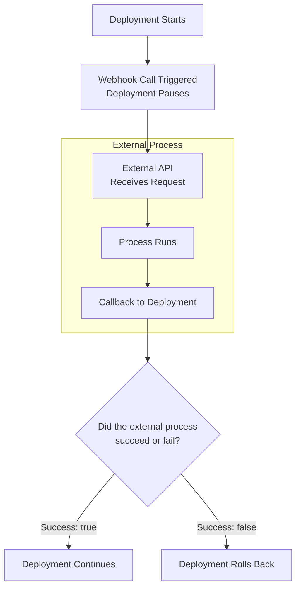

## When you should use webhook-based approvals

You can think of webhook-based approvals as a generic extensibility layer that enables you to call any API in any internet-accessible system. You can use a webhook to obtain a decision from a process that is external to Armory CDaaS.  

### Webhook use cases

**Before deployment**

- Upgrade a database schema
- Custom approval process

**Within your deployment strategy**

- Check logs and system health
- Run custom tests

**After deployment**

- Run integration tests in a staging environment
- Perform metric tests
- Run security scanners

## How webhook-based approval works

In order to accommodate a long-running process, Armory CDaaS supports the asynchronous webhook with callback pattern. You define the webhook in your deployment file and add a webhook call in the `constraints` section of your deployment definition or in a canary step.

**Basic flow**

The deployment process:
1. Encounters a webhook call
1. Calls the external API
1. Pauses deployment while waiting for the callback
1. Receives and processes callback
   - Success: deployment proceeds
   - Failure: deployment rolls back

{}
- If you have a manual approval in your deployment constraint and the webhook callback returns failure, the deployment rolls back without waiting for the manual approval.
- If Armory CDaaS hasn't received the webhook callback within 24 hours, the process times out and deployment fails.
- If an `afterDeployment` webhook callback returns failure, deployment is canceled to all environments that depend on the current environment, _but the current environment is not rolled back_.
{}

## Requirements for your webhook and callback

- The webhook must retrieve the callback URI from the payload or query parameters.
- The callback must use Bearer authorization and include a success value and optional message in the body.

### Retrieve an OAUTH token to use in your callback

Request format:


curl --request POST \
  --url https://auth.cloud.armory.io/oauth/token \
  --header 'Content-Type: application/x-www-form-urlencoded' \
  --data 'data=audience=https://api.cloud.armory.io&grant_type=client_credentials&client_id=$CDAAS_CLIENT_ID&client_secret=$CDAAS_CLIENT_SECRET'


Example response:


{
  "access_token": "<very long access token>",
  "scope": "manage:deploy read:infra:data exec:infra:op read:artifacts:data",
  "expires_in": 86400,
  "token_type": "Bearer"
}


### Callback format


curl --request POST \
  --url 'https://$CALLBACK_URI' \
  --header 'Authorization: Bearer $OAUTH_TOKEN' \
  --header 'Content-Type: application/json' \
  --data '{"success": true, "mdMessage": "Webhook successful"}'


Armory CDaaS looks for `success` value of `true` or `false` to determine the webhook's success or failure. `mdMessage` should contain a user-friendly message for Armory CDaaS to display in the UI and write to logs.

## How to configure a webhook in your deployment file

In your deployment file, you configure your webhook by adding a top-level `webhooks` section with the following information:


webhooks:
  - name: <webhook-name>
    method: <endpoint-method-type>
    uriTemplate: <endpoint-uri>
    networkMode: <network-mode>
    agentIdentifier: <remote-network-agent-id>
    headers:
      - key: Authorization
        value: <auth-type-and-value>
    bodyTemplate:
      inline: >-
      {
      }
    retryCount: <num-retries>


{}

### Configuration examples

The first example configures a GitHub webhook that uses token authorization, with the token value configured as a Armory CDaaS secret. This webhook requires the callback URI be passed in the request body. The payload also contains an `environment` context variable that you pass in when invoking the webhook in your deployment file.


webhooks:
  - name: myWebhook
    method: POST
    uriTemplate: https://api.github.com/repos/armory/docs-cdaas-demo/dispatches
    networkMode: direct
    headers:
      - key: Authorization
        value: token {{secrets.github_token}}
      - key: Content-Type
        value: application/json
    bodyTemplate:
      inline:  >-
        {
        "event_type": "webhookCallback",
        "client_payload": {
            "callbackUri": "{{armory.callbackUri}}/callback"
            "environment": "{{context.environment}}"
            }
        }
    retryCount: 3

 

The second example configures a webhook that is not accessible from the internet. The `networkMode` is set to `remoteNetworkAgent` and the `agentIdentifier` specifies which Remote Network Agent to use. The `agentIdentifier` value must match the **Agent Identifier** value listed on the **Agents** UI screen. The Authorization Bearer value is configured as a Armory CDaaS secret. Note that in this example, the callback URI is passed in the header.


webhooks:
  - name: integration-tests
    method: POST
    uriTemplate: https://integrations.armory.io/tests/
    networkMode: remoteNetworkAgent
    agentIdentifier: test-rna
    headers:
      - key: Authorization
        value: Bearer {{secrets.test_token}}
      - key: Location
        value: {{armory.callbackUri}}/callback
      - key: Content-Type
        value: application/json
      - key: environment
        value: {{context.environment}}
    retryCount: 5


## How to trigger a webhook

You can trigger a webhook from the following areas:

- Deployment constraints: `beforeDeployment` and `afterDeployment`
- A canary step within a canary strategy
- The `redirectTrafficAfter` section of a blue/green strategy

You add a `runWebhooks` section where you want to trigger the webhook.


- runWebhook:
    name: <webhook-name>
    context: []


- `name`: (Required) webhook name; must match the name you gave your webhook in the `webhooks` configuration section.
- `context`: (Optional) dictionary; declare values to use in templates or headers.

### Deployment constraints

**Before deployment**

In this example, you have a webhook named `Update-Database-Schema`. You want to trigger this webhook before your app gets deployed. So you trigger the webhook in the `beforeDeployment` constraint of your environment deployment.


targets:
  dev:
    account: dev-cluster
    namespace: myApp-dev
    strategy: rolling-canary
    constraints:
      beforeDeployment:
        - runWebhook:
            name: Update-Database-Schema


App deployment proceeds only if the `Update-Database-Schema` callback sends a "success: true" message.

**After deployment**

In this example, you have a webhook named `Run-Integration-Tests`. You want to trigger this webhook after your app has been deployed to staging but before it gets deployed to production. So you trigger the webhook in the `afterDeployment` constraint of your staging environment deployment.


targets:
  staging:
    account: staging-cluster
    namespace: myApp-staging
    strategy: rolling-canary
    constraints:
      afterDeployment:
        - runWebhook:
            name: Run-Integration-Tests
            context:
              environment: staging
  prod:
    account: prod-cluster
    namespace: myApp-prod
    strategy: rolling-canary
    constraints:
      dependsOn: ["staging"]


Deployment to production proceeds only if the `Run-Integration-Tests` callback sends a "success: true" message.

### Blue/green strategy

In this example, there is a `security-scan` webhook that scans your deployed app. You have a blue/green deployment strategy in which you want to run that security scan on the preview version of your app before switching traffic to it. You add the `runWebhook` section to the `redirectTrafficAfter` section in your blue/green strategy configuration.


strategies:
  myBlueGreen:
    blueGreen:
      activeService: myApp-external
      previewService: myApp-preview
      redirectTrafficAfter:
        - analysis:
            interval: 7
            units: seconds
            numberOfJudgmentRuns: 1
            rollBackMode: manual
            rollForwardMode: automatic
            queries:
              - avgCPUUsage-pass
        - runWebhook:
            name: security-scan


Since tasks in the `redirectTrafficAfter` section run in parallel, both tasks in this example must be successful for deployment to continue. If the `analysis` task fails, rollback is manual. If the `runWebhook` task fails, rollback is automatic.

### Canary strategy

In this example, there is a `system-health` webhook that you want to trigger as part of your canary strategy. Add the `runWebhook` section to your `steps` configuration.


strategies:
  canary-rolling:
    canary:
      steps:
        - setWeight:
            weight: 25
        - runWebhook:
            name: system-health
            context:
              environment: staging


## {}

For in-depth examples, see the following tutorials:

* 

