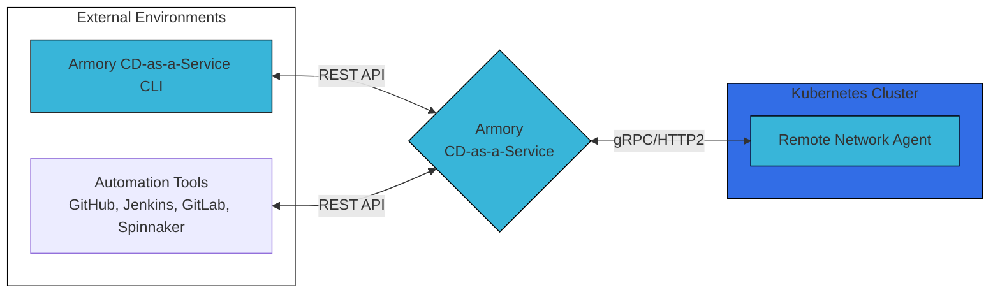

## Armory CD-as-a-Service overview

Armory CD-as-a-Service is a platform of cloud-based services that Armory operates. These services are used to orchestrate deployments and monitor their progress. These services have API endpoints that users and non-cloud services interact with. Details of the external URLs that need to be whitelisted are covered in [Networking](#networking).

Armory CD-as-a-Service contains components that you manage in your environment and components that Armory manages in its cloud. The components you manage enable Armory CD-as-a-Service to integrate with your existing infrastructure.

When you start a deployment from the CLI or an automation tool, Armory CD-as-a-Service forwards your deployment request to the designated RNA in your Kubernetes cluster. The RNA generates Kubernetes Custom Resource Definitions that it then uses to execute the deployment.

You can track the status of a deployment in the Armory CD-as-a-Service UI.

## Key Components

### Remote Network Agent (RNA)

The RNA allows Armory CD-as-a-Service to interact with your Kubernetes clusters and orchestrate deployments without direct network access to your clusters. The RNA that you install in your cluster engages in bidirectional communication with Armory CD-as-a-Service over encrypted, long-lived gRPC HTTP2 connections. The RNA issues API calls to your Kubernetes cluster based on requests from Armory CD-as-a-Service.

### CLI

Users install the CLI locally. The CLI interacts with Armory CD-as-a-Service via REST API. To deploy an app, the user must either log in using the CLI or must pass valid authorization credentials to the `deploy` command.

### GitHub Action

You can use the `armory/cli-deploy-action` to trigger a deployment from your GitHub workflow. The GitHub Action interacts with Armory CD-as-a-Service via REST API. The Action requires a valid Client ID and Client Secret be passed to the deploy command.

### Spinnaker plugin



## Networking

All network traffic is encrypted while in transit.

Encryption in transit is over HTTPS using TLS encryption. When using Armory-provided software for both the client and server, these connections are secured by TLS 1.2. Certain APIs support older TLS versions for clients that do not support 1.2.

Encryption at rest uses AES256 encryption.

The following network endpoints are used for communication into Armory CD-as-a-Service:

| DNS                       | Port | Protocol                                        | Description                                                                           |
|---------------------------|------|-------------------------------------------------|---------------------------------------------------------------------------------------|
| agent-hub.cloud.armory.io | 443  | TLS enabled gRPC over HTTP/2 TLS version 1.2 | Remote Network Agent Hub connection; Agent Hub routes deployment commands to RNAs and caches data received from them. Agent Hub does not require direct network access to the RNAs since they connect to Agent Hub through an encrypted, long-lived gRPC HTTP2 connection. Agent Hub uses this connection to send deployment commands to the RNA for execution. |
| api.cloud.armory.io       | 443  | HTTP over TLS (HTTPS) TLS version 1.2        | Armory REST API; Clients connect to these APIs to interact with Armory CD-as-a-Service.|
| auth.cloud.armory.io      | 443  | HTTP over TLS (HTTPS) TLS version 1.2        | OIDC Service; The Open ID Connect (OIDC) service is used to authorize and authenticate machines and users. The RNAs, Armory Enterprise (Spinnaker) plugin, and other services all authenticate against this endpoint. The service provides an identity token that can be passed to the Armory API and Agent Hub.                                                                          |
| console.cloud.armory.io   | 443  | HTTP over TLS (HTTPS) TLS version 1.2        | Web UI                                                                                |

## {}



 
 