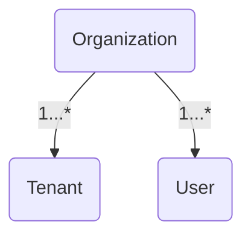
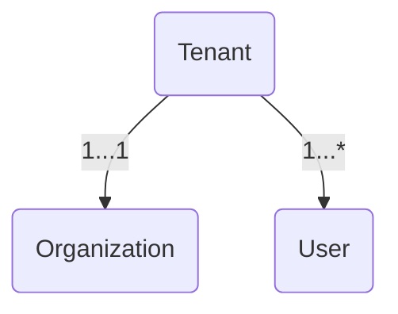
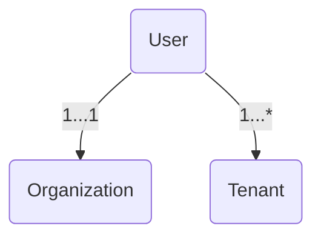

## Overview




* Has a collection of Users
* Has a collection of Tenants



* Belongs to a single Organization
* Has at least one User
* Has its own configuration, Remote Network Agents, and deployments



* Belongs to a single Organization
* Can be granted access to multiple Tenants within the Organization



When a user creates an account, CD-as-a-Service does the following:

* Creates an Organization for the company
* Creates a Tenant for the Organization
* Creates a User with an _Organization Admin_ role

For example, Shannon Singh works for a company called Foothold. When Shannon creates a new account, CD-as-a-Service creates these: 

* **Organization**: Foothold
* **Tenant**: main
* **Organization Admin**: Shannon Singh

As the Organization Admin, Shannon can do the following:
* [Create Tenants]()
* [Create User Roles]()
* [Invite Users]()
* [Assign Roles to Users]()
* [Create Machine-to-Machine Client Credentials]()

## How to organize your company workspace

How you organize your workspace depends on various factors. If you have a small team, a single tenant may serve your needs quite well. If you multiple apps and project teams, you may want to create several tenants.

### Scenario: one tenant for each app

Foothold has 3 project teams and wants app-level deployment separation.

| App   | Tenant    | User Role    | Project Team Members                        |
|-------|-----------|--------------|---------------------------------------------|
| Alpha | app-alpha | tenant-alpha | Priya, Aiden, Cassidy |
| Beta  | app-beta  | tenant-beta | Gabriela, Franz, Blake                      |
| Gamma | app-gamma | tenant-gamma |  Quinn, Sai, Cassidy      |

For this scenario, Organization Admin Shannon has to create the tenants and roles for users to access specific tenants. Then Shannon assigns roles to project team members, with Cassidy assigned two roles since she works on two different apps.

The drawback to this approach is that it may not scale if your company has or could have a lot of apps. 

### Scenario: one tenant for each project team

Foothold has 3 project teams and wants team-level deployment separation.

| Project Team | Tenant         | User Role       | Project Team Members                        |
|--------------|----------------|-----------------|---------------------------------------------|
| Wormhole     | team-wormhole  | tenant-wormhole | Priya, Aiden, Cassidy |
| Starship        | team-starship     | team-starship     | Gabriela, Franz, Blake                       |
| Nebula    | team-nebula | team-nebula | Quinn, Sai, Cassidy       |

Like the previous scenario, Organization Admin Shannon has to create the tenants and roles. Then he assigns roles to project team members, with Cassidy assigned two roles since she works on two different teams.

The advantage to this approach is that it supports project teams responsible for a varying number of apps at any given point in time. 

## {}

* 
* 
