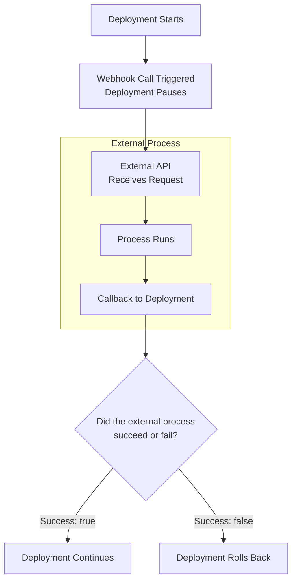

## When you should use webhook-based approvals

You can think of webhook-based approvals as a generic extensibility layer that enables you to call any API in any internet-accessible system. You can use a webhook to obtain a decision from a process that is external to Armory CD-as-a-Service.  

### Webhook use cases

**Before deployment**

- Upgrade a database schema
- Custom approval process

**Within your deployment strategy**

- Check logs and system health
- Run custom tests

**After deployment**

- Run integration tests in a staging environment
- Perform metric tests
- Run security scanners

## How webhook-based approval works

In order to accommodate a long-running process, Armory CD-as-a-Service supports the asynchronous webhook with callback pattern. You define the webhook in your deployment file and add a webhook call in the `constraints` section of your deployment definition or in a canary step.

**Basic flow**

The deployment process:
1. Encounters a webhook call
1. Calls the external API
1. Pauses deployment while waiting for the callback
1. Receives and processes callback
   - Success: deployment proceeds
   - Failure: deployment rolls back

{}
- If you have a manual approval in your deployment constraint and the webhook callback returns failure, the deployment rolls back without waiting for the manual approval.
- If Armory CD-as-a-Service hasn't received the webhook callback within 24 hours, the process times out and deployment fails.
- If an `afterDeployment` webhook callback returns failure, deployment is canceled to all environments that depend on the current environment, _but the current environment is not rolled back_.
{}

## Requirements for your webhook and callback

- The webhook must retrieve the callback URI from the payload or query parameters.
- The callback must use Bearer authorization and include a success value and optional message in the body.

### Retrieve an OAUTH token to use in your callback

Request format:


curl --request POST \
  --url https://auth.cloud.armory.io/oauth/token \
  --header 'Content-Type: application/x-www-form-urlencoded' \
  --data 'data=audience=https://api.cloud.armory.io&grant_type=client_credentials&client_id=$CDAAS_CLIENT_ID&client_secret=$CDAAS_CLIENT_SECRET'


Example response:


{
  "access_token": "<very long access token>",
  "scope": "manage:deploy read:infra:data exec:infra:op read:artifacts:data",
  "expires_in": 86400,
  "token_type": "Bearer"
}


### Callback format


curl --request POST \
  --url 'https://$CALLBACK_URI' \
  --header 'Authorization: Bearer $OAUTH_TOKEN' \
  --header 'Content-Type: application/json' \
  --data '{"success": true, "mdMessage": "Webhook successful"}'


Armory CD-as-a-Service looks for `success` value of `true` or `false` to determine the webhook's success or failure. `mdMessage` should contain a user-friendly message for Armory CD-as-a-Service to display in the UI and write to logs.

## {}

* 