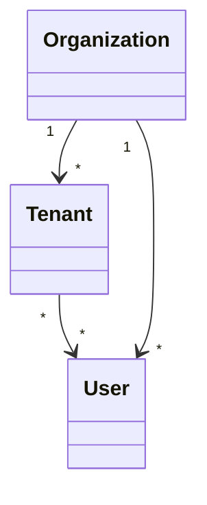

## Overview

* An _Organization_ represents a CD-as-a-Service customer (company), such as Apple or Google. 
* A _User_ is an employee of an Organization. Note that a User can belong to **only one** Organization.
* A _Tenant_ is a an organizational space. 
  * A Tenant has its own configuration, agents, and deployments. 
  * A Tenant belongs to a single Organization, but an Organization can have multiple Tenants. 
  * A Tenant has at least one User, but a User can have access to multiple Tenants.

## {}

* 
* 
