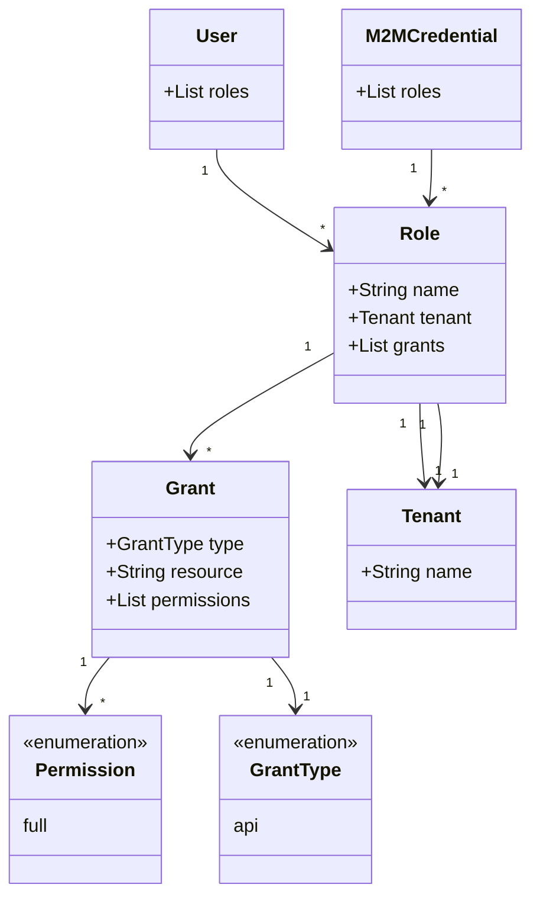

<!--
No mention of targetGroups, applications because that's not been implemented yet.
Removed grant types, resources, and permissions that haven't been (or won't be) implemented
-->

## Overview of RBAC in CD-as-a-Service

Central to CD-as-a-Service's [RBAC](https://en.wikipedia.org/wiki/Role-based_access_control) implementation is a _Role_, which defines what a user can do within the platform. Each Role has a _Grant_ collection that defines permissions.

You define your roles in a YAML file that has this structure:


roles:
  - name: <role-name>
    tenant: <tenant-name>
    grants:
      - type: <type>
        resource: <resource>
        permission: <permission>


You can create an organization-wide role by omitting the `tenant` definition.

After you define your roles, you use the CLI to [add your roles]() to your CD-as-a-Service Organization. You do all subsequent role management with the CLI, but you [assign roles to users]() using the UI.

All users must have at least one role in order to use CD-as-a-Service. If a user has login credentials but no role assigned, the user sees a blank **Deployments** screen after logging in.



## Grants

The `grants` section is where you define your role's permissions.

## Platform roles

The system-defined _Organization Admin_ role is a platform-wide role that has superuser permissions within CD-as-a-Service. In the UI, an Organization Admin has full access to all screens and functionality. Additionally, the Organization Admin has full authority to execute all CLI commands.

You cannot modify or delete the Organization Admin role.

## SSO support

@TODO document how to configure SSO in CDaaS

If your organization uses SSO to

## Examples

### Tenant Admin role

This example defines three Tenant Admin roles, one for each tenant. Each role has full authority within the specified tenant.


roles:
  - name: Tenant Admin Main
    tenant: main
    grants:
      - type: api
        resource: tenant
        permission: full
  - name: Tenant Admin Finance
    tenant: finance
    grants:
      - type: api
        resource: tenant
        permission: full
  - name: Tenant Admin Commerce
    tenant: commerce
    grants:
      - type: api
        resource: tenant
        permission: full


If you want to grant a user permission to manage all of your tenants, assign that user the **Organization Admin** role using the UI.

### Deployment roles

This example defines a role that grants permission to use the **Deployments** UI and start deployments using the CLI. The role is bound to the `finance` tenant.


roles:
  - name: Deployer
    tenant: finance
    grants:
      - type: api
        resource: deployment
        permission: full


This example defines a role that grants permission to use the **Deployments** UI and start deployments using the CLI across your entire organization. Note that `tenant` is not defined, which makes this an organization-wide role.


roles:
  - name: Deployer
    grants:
      - type: api
        resource: deployment
        permission: full


## {}

* 
* 
* 
*  tutorial

 
 

<!--
## Not for primetime
aimee scratchpad

aimee's scratchpad stuff below

<table>
<tr>
<td>deployment.yaml</td>
<td>rbac.yaml</td>
</tr>
<tr>
<td>

version: v1
kind: kubernetes
application: potato-facts
# Map of Deployment Targets, this is set up in a way where
# we can do multi-target deployments (multi-region or multi-cluster)
targets:
  # This in the name of a deployment. Underneath it is its configuration.
  staging:
    # the name of an agent configured account
    account: acme-eks-staging-cluster
    # Optionally override the namespaces that are in the manifests
    namespace: potato-facts
    # This is the key to a strategy under the strategies map
    strategy: rolling
    constraints:
      dependsOn: ["dev"]
      beforeDeployment: []
 prod-east:
    # the name of an agent configured account
    account: acme-eks-prod-east-cluster
    # Optionally override the namespaces that are in the manifests
    namespace: potato-facts
    # This is the key to a strategy under the strategies map
    strategy: mycanary
    constraints:
      dependsOn: ["staging"]
      beforeDeployment:
        - pause:
            untilApproved: true
  prod-west:
    # the name of an agent configured account
    account: acme-eks-prod-west-cluster
    # Optionally override the namespaces that are in the manifests
    namespace: potato-facts
    # This is the key to a strategy under the strategies map
    strategy: myBlueGreen
    constraints:
      dependsOn: ["staging"]
      beforeDeployment:
        - pause:
            untilApproved: true

</td>
<td>

targetGroups:
  - name: potato-facts
    # optional field, defaults to main
    tenant: main
    targets:
      - name: staging
        account: acme-eks-staging-cluster
        kubernetes:
          namespace: potato-facts
      - name: prod-east
        account: acme-eks-prod-east-cluster
        kubernetes:
          namespace: potato-facts
      - name: prod-west
        account: acme-eks-prod-west-cluster
        kubernetes:
          namespace: potato-facts

roles:
  - name: Potato Facts Role
    # optional field, defaults to main
    tenant: main
    grants:
      - type: account
        resource: acme-eks-dev-cluster
        permission: full
      - type: targetGroup
        resource: potato-facts
        permission: full
      - type: api
        resource: deployment
        permission: full
  - name: Tenant Admin
    # optional field, defaults to main
    tenant: main
    grants:
      - type: api
        resource: tenant
        permission: full
  - name: Organization Admin
    grants:
      - type: api
        resource: organization
        permission: full
  - name: Remote Network Agent
    grants:
      - type: api
        resource: agent-hub
        permission: connect         

</td>
</tr>
</table>

    

deployment.yaml  |  rbac.yaml
--|--
{}  |  {}

-->