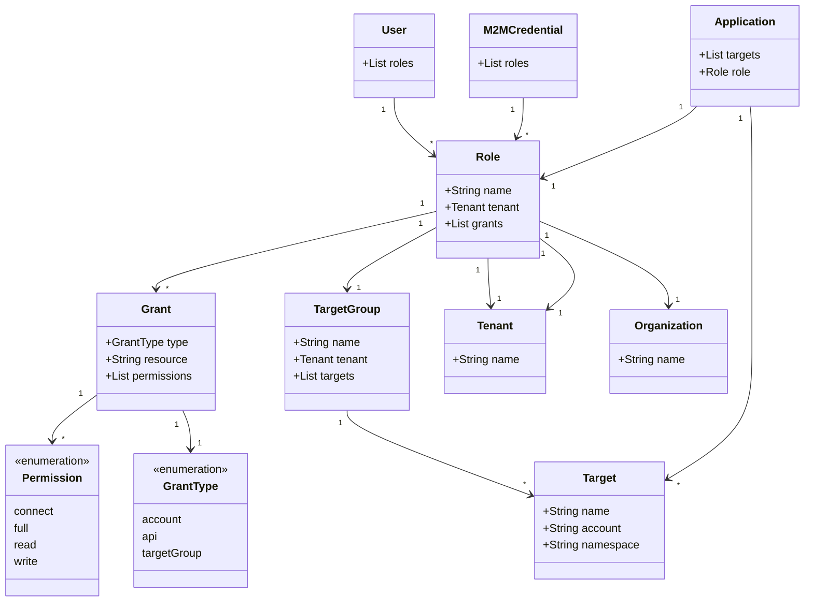

THIS IS AIMEE'S SCRATCH PAGE AND NOT READ FOR PRIME TIME

<table>
<tr>
<td>deployment.yaml</td>
<td>rbac.yaml</td>
</tr>
<tr>
<td>

version: v1
kind: kubernetes
application: potato-facts
# Map of Deployment Targets, this is set up in a way where
# we can do multi-target deployments (multi-region or multi-cluster)
targets:
  # This in the name of a deployment. Underneath it is its configuration.
  staging:
    # the name of an agent configured account
    account: acme-eks-staging-cluster
    # Optionally override the namespaces that are in the manifests
    namespace: potato-facts
    # This is the key to a strategy under the strategies map
    strategy: rolling
    constraints:
      dependsOn: ["dev"]
      beforeDeployment: []
 prod-east:
    # the name of an agent configured account
    account: acme-eks-prod-east-cluster
    # Optionally override the namespaces that are in the manifests
    namespace: potato-facts
    # This is the key to a strategy under the strategies map
    strategy: mycanary
    constraints:
      dependsOn: ["staging"]
      beforeDeployment:
        - pause:
            untilApproved: true
  prod-west:
    # the name of an agent configured account
    account: acme-eks-prod-west-cluster
    # Optionally override the namespaces that are in the manifests
    namespace: potato-facts
    # This is the key to a strategy under the strategies map
    strategy: myBlueGreen
    constraints:
      dependsOn: ["staging"]
      beforeDeployment:
        - pause:
            untilApproved: true

</td>
<td>

targetGroups:
  - name: potato-facts
    # optional field, defaults to main
    tenant: main
    targets:
      - name: staging
        account: acme-eks-staging-cluster
        kubernetes:
          namespace: potato-facts
      - name: prod-east
        account: acme-eks-prod-east-cluster
        kubernetes:
          namespace: potato-facts
      - name: prod-west
        account: acme-eks-prod-west-cluster
        kubernetes:
          namespace: potato-facts

roles:
  - name: Potato Facts Role
    # optional field, defaults to main
    tenant: main
    grants:
      - type: account
        resource: acme-eks-dev-cluster
        permission: full
      - type: targetGroup
        resource: potato-facts
        permission: full
      - type: api
        resource: deployment
        permission: full
  - name: Tenant Admin
    # optional field, defaults to main
    tenant: main
    grants:
      - type: api
        resource: tenant
        permission: full
  - name: Organization Admin
    grants:
      - type: api
        resource: organization
        permission: full
  - name: Remote Network Agent
    grants:
      - type: api
        resource: agent-hub
        permission: connect         

</td>
</tr>
</table>

    

deployment.yaml  |  rbac.yaml
--|--
{}  |  {}

