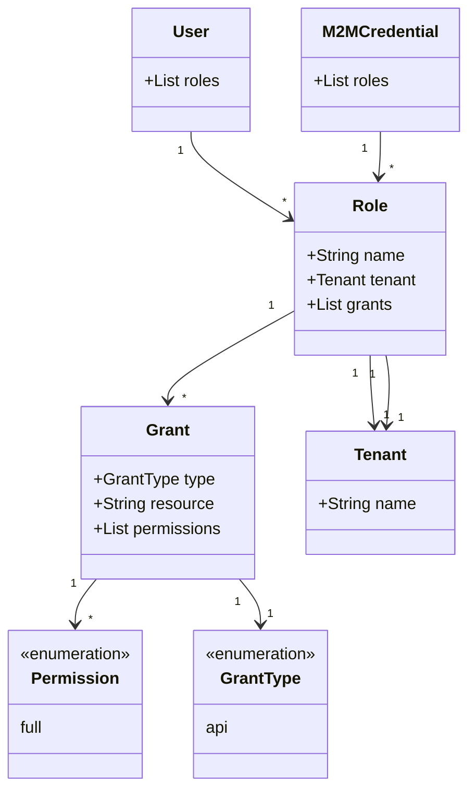

<!--
No mention of targetGroups, applications because that's not been implemented yet.
Removed grant types, resources, and permissions that haven't been (or won't be) implemented
-->

## Overview of RBAC in CD-as-a-Service

Central to CD-as-a-Service's RBAC implementation is the concept of a _Role_, which defines what a user or Client Credential can do within the platform. Each Role has a _Grant_ collection that defines platform permissions.

You define your roles in a YAML file and then use the CLI to apply those roles to your CD-as-a-Service _Organization_.

### Role

You can bind a Role to your Organization or to a _Tenant_ within your Organization.


roles:
  - name: <role-name>
    tenant: <tenant-name>
    grants: []


`tenant`
- If you want to bind your role to a tenant, you must specify the tenant's name.
- The default tenant is `main`.

### Grant

### GrantType

### Permission

## Organization Admin

The system-defined _Organization Admin_ role is a platform-wide role that has superuser permissions within CD-as-a-Service. In the UI, an Organization Admin has full access to all screens and functionality. The same applies to using the CLI. The Organization Admin has full access to execute all commands.

You cannot modify or delete the Organization Admin role.

## SSO support

## {}



## Not for primetime
<!--
aimee scratchpad
-->

aimee's scratchpad stuff below

<table>
<tr>
<td>deployment.yaml</td>
<td>rbac.yaml</td>
</tr>
<tr>
<td>

version: v1
kind: kubernetes
application: potato-facts
# Map of Deployment Targets, this is set up in a way where
# we can do multi-target deployments (multi-region or multi-cluster)
targets:
  # This in the name of a deployment. Underneath it is its configuration.
  staging:
    # the name of an agent configured account
    account: acme-eks-staging-cluster
    # Optionally override the namespaces that are in the manifests
    namespace: potato-facts
    # This is the key to a strategy under the strategies map
    strategy: rolling
    constraints:
      dependsOn: ["dev"]
      beforeDeployment: []
 prod-east:
    # the name of an agent configured account
    account: acme-eks-prod-east-cluster
    # Optionally override the namespaces that are in the manifests
    namespace: potato-facts
    # This is the key to a strategy under the strategies map
    strategy: mycanary
    constraints:
      dependsOn: ["staging"]
      beforeDeployment:
        - pause:
            untilApproved: true
  prod-west:
    # the name of an agent configured account
    account: acme-eks-prod-west-cluster
    # Optionally override the namespaces that are in the manifests
    namespace: potato-facts
    # This is the key to a strategy under the strategies map
    strategy: myBlueGreen
    constraints:
      dependsOn: ["staging"]
      beforeDeployment:
        - pause:
            untilApproved: true

</td>
<td>

targetGroups:
  - name: potato-facts
    # optional field, defaults to main
    tenant: main
    targets:
      - name: staging
        account: acme-eks-staging-cluster
        kubernetes:
          namespace: potato-facts
      - name: prod-east
        account: acme-eks-prod-east-cluster
        kubernetes:
          namespace: potato-facts
      - name: prod-west
        account: acme-eks-prod-west-cluster
        kubernetes:
          namespace: potato-facts

roles:
  - name: Potato Facts Role
    # optional field, defaults to main
    tenant: main
    grants:
      - type: account
        resource: acme-eks-dev-cluster
        permission: full
      - type: targetGroup
        resource: potato-facts
        permission: full
      - type: api
        resource: deployment
        permission: full
  - name: Tenant Admin
    # optional field, defaults to main
    tenant: main
    grants:
      - type: api
        resource: tenant
        permission: full
  - name: Organization Admin
    grants:
      - type: api
        resource: organization
        permission: full
  - name: Remote Network Agent
    grants:
      - type: api
        resource: agent-hub
        permission: connect         

</td>
</tr>
</table>

    

deployment.yaml  |  rbac.yaml
--|--
{}  |  {}

