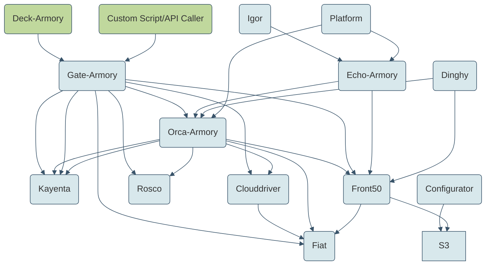
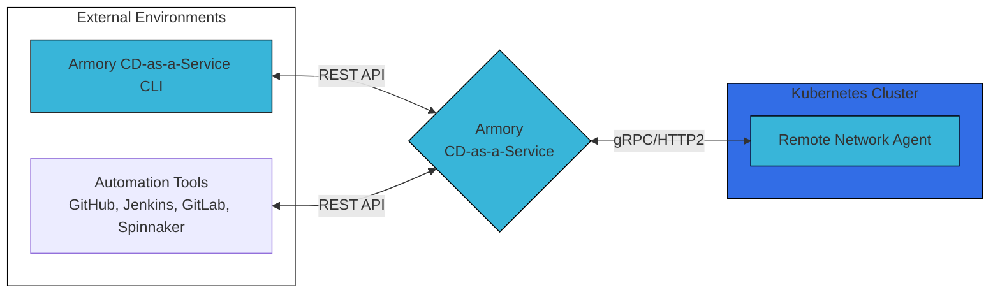
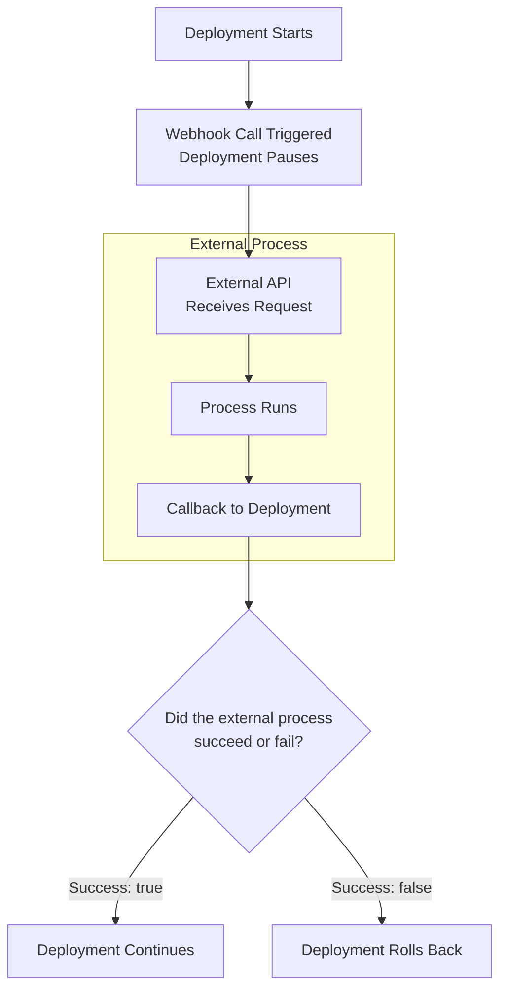

## Mermaid in Docsy
Support for Mermaid diagrams is included in the [Docsy theme](https://www.docsy.dev/docs/adding-content/lookandfeel/#diagrams-with-mermaid).

## Graph example

Show me the code.





## Flowchart examples

Show me the code.





 
 
 

Show me the code.





## Resources

* [Mermaid docs](https://mermaid-js.github.io/mermaid/#/)
* [Mermaid GitHub](https://github.com/mermaid-js/mermaid)