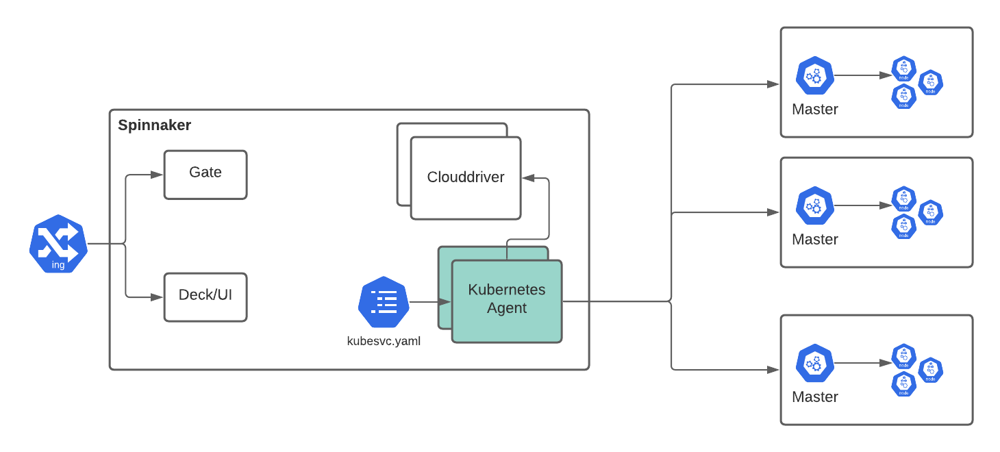
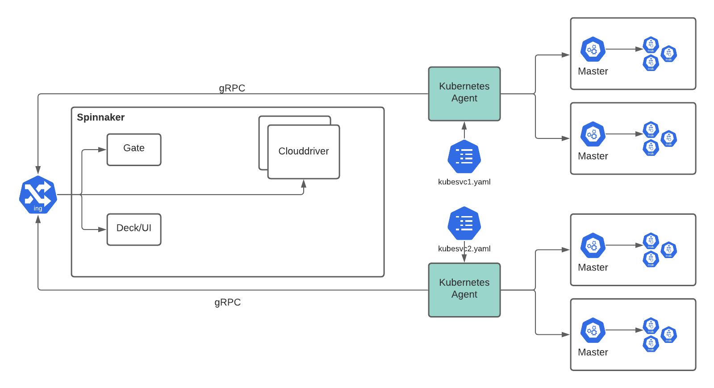
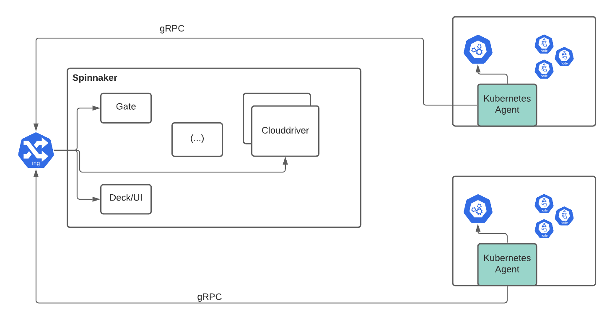

The Armory Agent is a lightweight service that connects back to Spinnaker's Clouddriver service and streams changes from the Kubernetes clusters it is configured with.

> The Agent connects back to a new port opened on Clouddriver using gRPC

## Topologies

### Spinnaker Service Mode

In this mode, the Agent is installed as a new Spinnaker service (`spin-kubesvc`) and can be configured like other services.

If you have some automation to provision clusters, the Agent can dynamically reload accounts when `kubesvc.yaml` changes. You could, for example, configure accounts in a `configMap` mounting to `/opt/spinnaker/config/kubesvc-local.yaml`.  `configMap` changes are reflected in the Agent within seconds (after etcd sync).

### Infrastructure Mode

In infrastructure mode, multiple Agent deployments handle different groups of Kubernetes clusters. Each deployment is configured separately.

> Account name must still be unique across all your infrastructure. Clouddriver will reject new accounts with a name that matches a different cluster.

### Agent Mode

In this mode, the Agent acts as a piece of infrastructure. It is provisioned with a `serviceAccount` properly scoped to what you want Spinnaker to do. The cluster will disappear from Spinnaker after a grace period when the cluster is deleted (or when the Agent is stopped.)

## Security

The first security principle is that the Armory Agent does outbound calls only - except for a local health check. This also means that you can have agents running on premise or in public clouds such as AWS, GCP, Azure, Oracle, or Alibaba.

What Spinnaker can do in the target cluster is limited by what it is running as:
- a `serviceAccount` in agent mode
- a `kubeconfig` setup for infrastructure or Spinnaker service mode.

Communications are secured with TLS and optionally mTLS.

Furthermore in **agent mode**, Spinnaker never gets credentials and account registration is dynamic.

## Communication with Clouddriver

Armory Agent communicates with Clouddriver over a single gRPC connection. The connection can be over TLS (optionally mTLS). You can terminate TLS:

1. On Clouddriver: in case of Spinnaker Service mode or if declaring `spin-clouddriver-grpc` as a network load balancer.
2. On a gRPC proxy that directs request to the `spin-clouddriver-grpc` service.

Spinnaker will use the bi-directional communication channel to receive changes from Kubernetes accounts as well as send operations to the Agent.

### Information Sent by the Agent

The Agent will send the following information about the cluster it is watching back to Spinnaker:
- Account properties as configured in `kubernetes.accounts[]`
- Kubernetes API server host, certificate fingerprint, version
- All the Kubernetes object it 1) is configured to do 2) has permissions to access. You can ignore certain Kubernetes kinds (`kubernetes.accounts[].omitKinds`) or whitelist kinds to watch (`kubernetes.accounts[].kinds`).

> The Agent always scrubs data from `Secret` in memory before they are sent and even make it on to the Agent's memory heap.

### Permissions:

The Armory Agent can run with your kubernetes cluster with many different levels of granularity.  Access to the kubernetes namespaces and event bus is fully configurable to meet even the most regulated cluster configurations.  The permissions are inherited by the kubernetes role binding used when installing the agent.  This means you can have 1 Armory Agent for the entire Kubernetes cluster or multiple with limited access to namespaces and events.
Account Management:
The Armory Agent can assume any service accounts within the cluster for Spinnaker deployment pipelines.  

## Scalability

Kubernetes Deployments

Kube Agent is all about distributing work and high scale deployments.  This is to combat the growing number of kubernetes clusters, environments, and regions seen in the field.  By distributing the processing work for Spinnaker and optimizing the way Clouddriver collects information we can push Spinnaker to even further scales than what has been seen before.

Armory Agent Multicloud Kubernetes Deployments.

A single large Agent will perform just as well as many smaller Agents.  You can choose the deployment option that best fits your software deployment strategy.

## Resiliency

Armory Engineering has ensured that Kube Agent is made for all production cloud use cases.  This includes failure.  We understand that things don’t always go smoothly and with that in mind have created a highly resilient kubernetes deployment system.

## Armory Agent communication to Armory SaaS

The Agent design works extremely well with Armory Spinnaker SaaS.  Kube Agent can reach out and register itself with your Armory SaaS instance.

If the Primary Agent fails, the Secondary monitoring Kubernetes cluster 1 will pickup and start forwarding events and performing operations where the Primary Agent left off.  There can be any number of Agents monitoring a Kubernetes cluster at one time.
