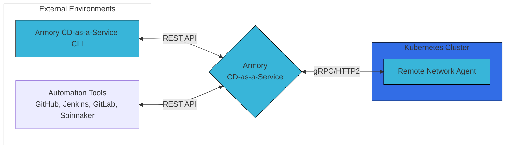

```mermaid
flowchart LR
   id0<--"REST API"-->id2
   id1<--"REST API"-->id2
   id2<--"gRPC/HTTP2"-->id3

   subgraph outside [External Environments]
   id0[Armory CD-as-a-Service CLI]
   id1[Automation Tools<br>GitHub, Jenkins, GitLab, Spinnaker]
   end

   id2{Armory<br>CD-as-a-Service}

   subgraph kubernetes [Kubernetes Cluster]
   id3[Remote Network Agent]
   end

   classDef k8s fill:#326de6,stroke:#000000,stroke-width:1px
   classDef armory fill:#38b5d9,stroke:#000000,stroke-width:1px
   classDef ext fill:#ffffff,stroke:#000000,stroke-width:1px
   class kubernetes k8s
   class id2,id3,id0 armory
   class outside ext
```