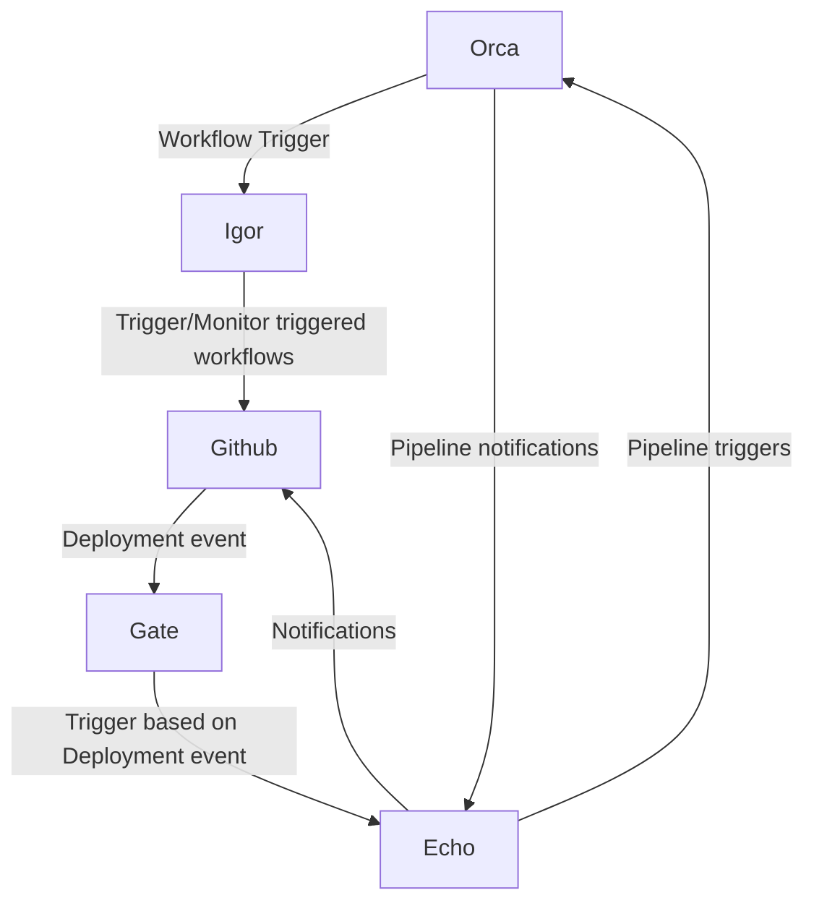
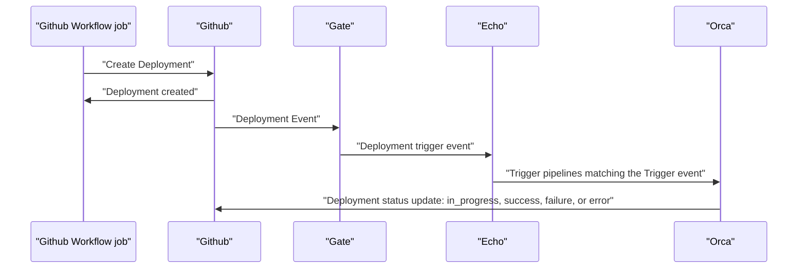

## GitHub API Plugin features

The GitHub API Plugin provides GitHub integration features that Spinnaker lacks:

- Trigger a Spinnaker pipeline from a GitHub workflow using **workflow_dispatch** or **repo_dispatch** events
- Trigger a Spinnaker pipeline automatically when a GitHub workflow finishes successfully
- Trigger a Spinnaker pipeline when a new GitHub Deployment is created
- Monitor a GitHub workflow and finish pipeline execution based on the GitHub workflow result
- Update GitHub deployment status based on Spinnaker pipeline conclusion
- View Github Action Logs in Spinnaker -- there is no need to navigate to GitHub to view the logs

All the integration points mentioned above use the concept of GitHub Apps.

A GitHub App is a type of integration you can build to interact with and extend the functionality of GitHub. You can build a GitHub App to provide flexibility and reduce process friction without signing in as a user or creating a service account.

One of the use cases of a Github app is integrating your tool or external service with GitHub, which in our case is Spinnaker.
GitHub Apps can be installed directly on organizations or personal accounts and granted access to specific repositories. They come with built-in webhooks and narrow, specific permissions.

## How the plugin works with GitHub

Deployment flow diagram

## Compatibility matrix



## Installation paths

{}
{}
Use a Kustomize patch to install the plugin.

1. Create a GitHub App and install it in your repo.
1. Install the plugin using the Armory Operator.

[Instructions]()
{}

{}
Use a Kustomize patch to install the plugin.

1. Create a GitHub App and install it in your repo.
1. Install the plugin using the Spinnaker Operator.

[Instructions]()
{}

{}
Use Spinnaker local config files to install the plugin.

1. Create a GitHub App and install it in your repo.
1. Install the plugin in local config files and apply those changes using Halyard.

[Instructions]()
{}
{}