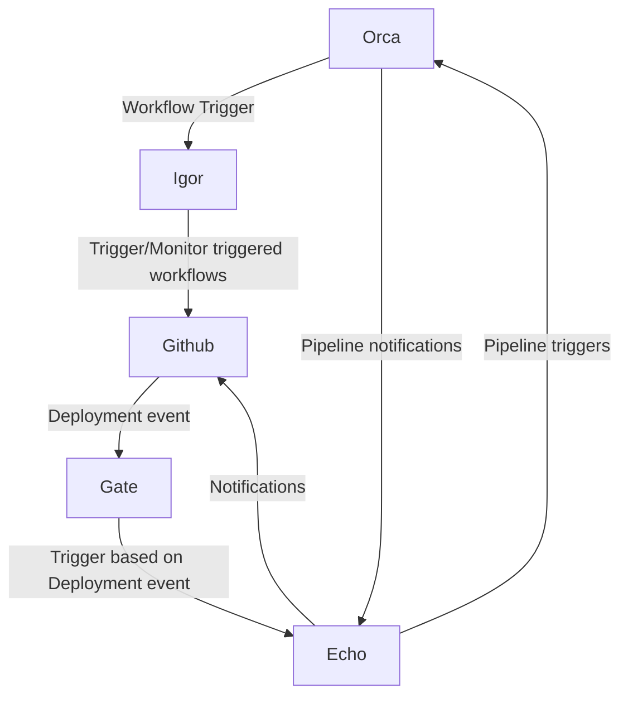
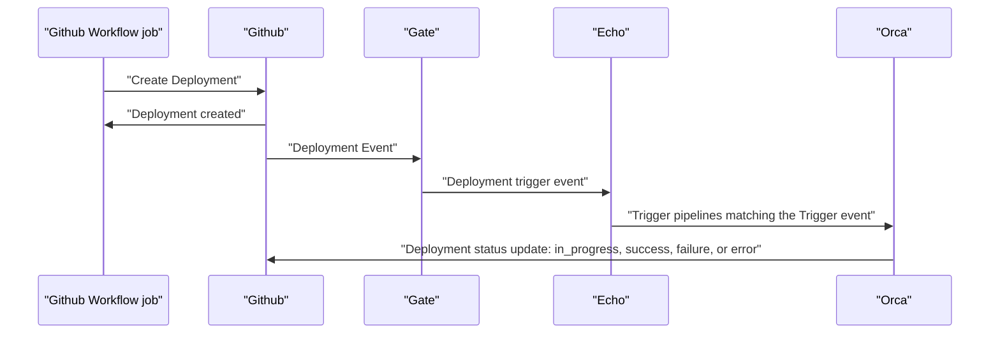

## What the GitHub API plugin does

Spinnaker is not offering a native integration with GitHub actions as it does with other CI systems like Jenkin, Gitlab CI, Travis, etc. 

By using the GitHub API plugin, we offer you multiple integration points between GitHub and Spinnaker: 

- Spinnaker stages to trigger GitHub workflows using **workflow_dispatch** or **repo_dispatch** events
- Monitor GH workflow and finish the pipeline execution based on the GitHub Workflow conclusion
- Trigger a Spinnaker pipeline automatically when a GitHub workflow finishes successfully
- Trigger a Spinnaker pipeline when a new GitHub Deployment is created
- Update GitHub deployment status based on Spinnaker pipeline conclusion
- View Github Action Logs in Spinnaker, meaning there is no need to navigate to GitHub to view the logs

All the integration points mentioned above use the concept of GitHub Apps.

A GitHub App is a type of integration you can build to interact with and extend the functionality of GitHub. You can build a GitHub App to provide flexibility and reduce process friction without signing in as a user or creating a service account.

One of the use cases of a Github app is integrating your tool or external service with GitHub, which in our case is Spinnaker.
GitHub Apps can be installed directly on organizations or personal accounts and granted access to specific repositories. They come with built-in webhooks and narrow, specific permissions.

## How the plugin works with GitHub

Deployment flow diagram

## Compatibility matrix

## Installation paths