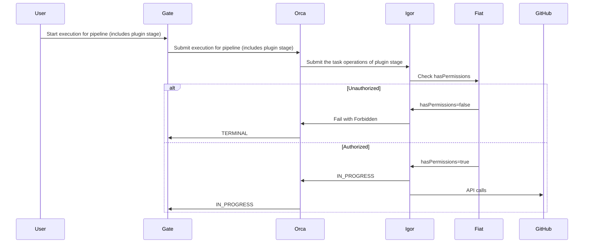

 

## Authorization (AuthZ)

This feature enables AuthZ support for GitHub App accounts providing:

**Compliance and Security**
* Authz for GitHub App accounts allows you to enforce access controls on a per-account basis, securing access to specific
repositories and/or GitHub organisations to only authorised groups/teams.

**Granular Control**
* Authz for GitHub App accounts provides granular control over who can perform actions within each account. This 
fine-grained permission control is crucial for maintaining a least privilege principle, where users have only the necessary access to perform their tasks, reducing the overall security surface.

**Scalability**
* Authz for GitHub App accounts scales effectively as the number of accounts grows. This scalability is essential for 
organizations managing diverse and expanding infrastructure, ensuring that access controls remain manageable 
and effective.

Fiat is the Spinnaker microservice responsible for authorization (authz) for the other Spinnaker services. 
It is not enabled by default, so users are able to perform any action in Spinnaker. When enabled, Fiat checks the user's permissions before allowing the action to proceed.

### How this feature works

The GitHub Integration plugin supports Fiat authz for GitHub App accounts configured to determine whether a role or group can perform the following actions:

- `READ`: A user can view the GitHub App account's configuration and/or use it as a trigger source.
- `WRITE`: A user can use the GitHub App account as the target account for the GitHub integration plugin stages.

### {}

- You are familiar with how Spinnaker's [AuthZ]() works.
- You have read the GitHub Integration Plugin [overview]().
- You have enabled Fiat in your Spinnaker or Armory CD instance integrated with an external identity provider (IDP).

### How to enable AuthZ support

You can enable AuthZ support per GitHub App account by setting the `permissions` block in the `github-integration-plugin.yml` file. For example:


github:
  plugin:
    accounts:
      - name: FirstAppRepo
        organization:  company-public
        repository: first-app-repo
        defaultBranch: master
        githubAppId: 9753
        githubAppPrivateKey: encrypted:k8s!n:spin-secrets!k:github-app-9753-privatekey
        permissions:
          READ: 
            - "read-only-role"
            - "dev-role"
            - "ops-role"
          EXECUTE:
            - "dev-role"
            - "ops-role"
      - name: SecondAppRepo
        organization:  company-public
        repository: second-app-repo
        defaultBranch: main
        githubAppId: 9753
        githubAppPrivateKey: encrypted:k8s!n:spin-secrets!k:github-app-9753-privatekey
        permissions: []
      - name: CompanyPrivateOrgAllRepos
        organization: company-private
        orgWideInstallation: true
        includePublicRepositories: false
        defaultBranch: main
        githubAppId: 1357
        githubAppPrivateKey: encrypted:k8s!n:spin-secrets!k:github-app-1357-privatekey
        permissions:
          READ:
            - "read-only-role"
            - "ops-role"
          EXECUTE:
            - "ops-role"

