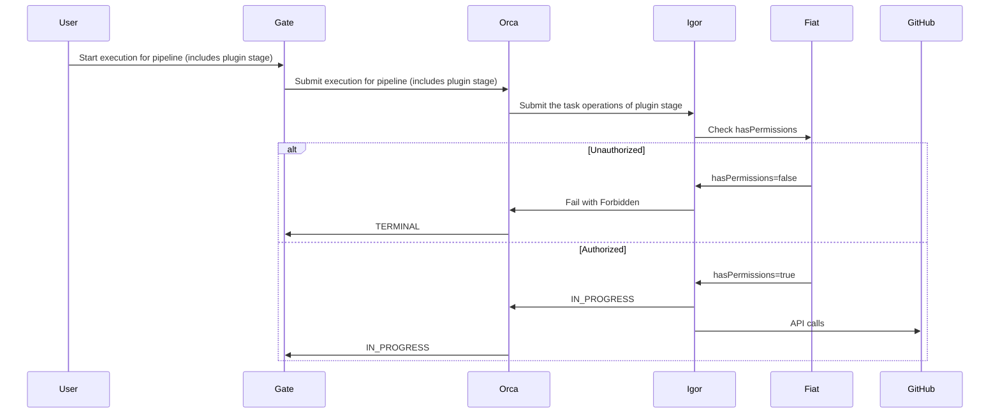
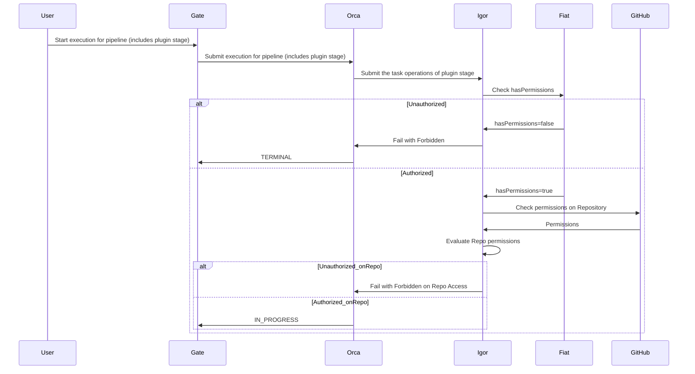

 

## Authorization (AuthZ) support for GitHub App accounts

Fiat is the microservice in Spinnaker responsible for authorization (authz) for the other Spinnaker services. 
By default, it is not enabled, so users are able to perform any action in Spinnaker. 
When enabled, Fiat will check the user's permissions before allowing the action to proceed.

GitHub integration plugin supports Fiat authz for GitHub App accounts configured to determine whether a role or group 
can perform the following actions:

- `READ`: A user can view the GitHub App account's configuration and/or use it as a trigger source.
- `WRITE`: A user can use the GitHub App account as the target account for the GitHub integration plugin stages.

**How this feature works**



**Pre-requisites**

- You are familiar with how Spinnaker's [AuthZ](https://docs.armory.io/continuous-deployment/overview/fiat-permissions-overview/) works.
- You have read the GitHub Integration Plugin [overview]().
- You have enabled Fiat micorservice in your Spinnaker or Armory CD instance integrated with an external identity provider (IDP).

**How to enable**

AuthZ support can be enabled per GitHub App account by setting the `permissions` block in the `github-integration-plugin.yml` file.

```yaml
github:
  plugin:
    accounts:
      - name: FirstAppRepo
        organization:  company-public
        repository: first-app-repo
        defaultBranch: master
        githubAppId: 9753
        githubAppPrivateKey: encrypted:k8s!n:spin-secrets!k:github-app-9753-privatekey
        permissions:
          READ: 
            - "read-only-role"
            - "dev-role"
            - "ops-role"
          EXECUTE:
            - "dev-role"
            - "ops-role"
      - name: SecondAppRepo
        organization:  company-public
        repository: second-app-repo
        defaultBranch: main
        githubAppId: 9753
        githubAppPrivateKey: encrypted:k8s!n:spin-secrets!k:github-app-9753-privatekey
        permissions: []
      - name: CompanyPrivateOrgAllRepos
        organization: company-private
        orgWideInstallation: true
        includePublicRepositories: false
        defaultBranch: main
        githubAppId: 1357
        githubAppPrivateKey: encrypted:k8s!n:spin-secrets!k:github-app-1357-privatekey
        permissions:
          READ:
            - "read-only-role"
            - "ops-role"
          EXECUTE:
            - "ops-role"
```

## Validate GitHub access based on GitHub App account assigned configuration
Using the `impersonateGitHubTeam` feature in the GitHub Integration plugin, GitHub App accounts access to repositories 
can be validated and enforced based on the GitHub team's assigned configuration.

**How this feature works**

GitHub integration plugin will validate before performing any action in a pipeline stage that the GitHub Teams configured
using the `impersonateGitHubTeam` feature are assigned with one of the following roles in GitHub:
- `Admin`: Full access to the repository
- `Write`: Read and write access to the repository
- `Maintain`: Read and write access to the repository, including managing issues and pull requests

If the GitHub team does not have appropriate access to the repository, the pipeline stage will fail with an error message.



**How to enable**
`impersonateGitHubTeam` feature can be enabled per GitHub App account by setting the `impersonateGitHubTeam` block in the `github-integration-plugin.yml` file.

```yaml
github:
  plugin:
    accounts:
      - name: FirstAppRepo
        organization:  company-public
        repository: first-app-repo
        defaultBranch: master
        githubAppId: 9753
        githubAppPrivateKey: encrypted:k8s!n:spin-secrets!k:github-app-9753-privatekey
        permissions:
          READ: 
            - "read-only-role"
            - "dev-role"
            - "ops-role"
          EXECUTE:
            - "dev-role"
            - "ops-role"
        impersonateGitHubTeam: []
      - name: SecondAppRepo
        organization:  company-public
        repository: second-app-repo
        defaultBranch: main
        githubAppId: 9753
        githubAppPrivateKey: encrypted:k8s!n:spin-secrets!k:github-app-9753-privatekey
        permissions: []
        impersonateGitHubTeam:
          - "dev-github-team"
          - "ops-github-team"
      - name: CompanyPrivateOrgAllRepos
        organization: company-private
        orgWideInstallation: true
        includePublicRepositories: false
        defaultBranch: main
        githubAppId: 1357
        githubAppPrivateKey: encrypted:k8s!n:spin-secrets!k:github-app-1357-privatekey
        impersonateGitHubTeam:
          - "admin-github-team"
        permissions:
          READ:
            - "read-only-role"
            - "ops-role"
          EXECUTE:
            - "ops-role"
```

## Configure GitHub Commit Status Echo notifications

**How this feature works**

**How to enable**

**Migrating from Spinnaker's default implementation**

## GitHub Commit Status pipeline Stage

**How this feature works**

**How to enable**

**Migrating from a Orca preconfigure webhook implementation**