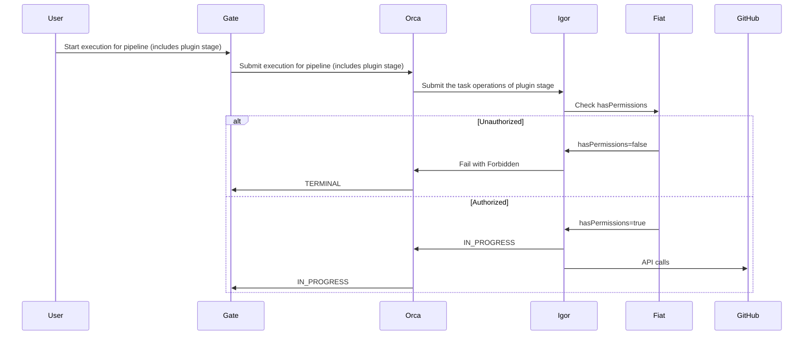
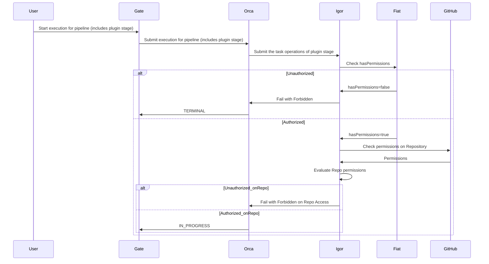

 

## Authorization (AuthZ)

This feature enables AuthZ support for GitHub App accounts.

Fiat is the Spinnaker microservice responsible for authorization (authz) for the other Spinnaker services. It is not enabled by default, so users are able to perform any action in Spinnaker. When enabled, Fiat checks the user's permissions before allowing the action to proceed.

### How this feature works

The GitHub Integration plugin supports Fiat authz for GitHub App accounts configured to determine whether a role or group can perform the following actions:

- `READ`: A user can view the GitHub App account's configuration and/or use it as a trigger source.
- `WRITE`: A user can use the GitHub App account as the target account for the GitHub integration plugin stages.

### {}

- You are familiar with how Spinnaker's [AuthZ]() works.
- You have read the GitHub Integration Plugin [overview]().
- You have enabled Fiat in your Spinnaker or Armory CD instance integrated with an external identity provider (IDP).

### How to enable AuthZ support

You can enable AuthZ support per GitHub App account by setting the `permissions` block in the `github-integration-plugin.yml` file. For example:


github:
  plugin:
    accounts:
      - name: FirstAppRepo
        organization:  company-public
        repository: first-app-repo
        defaultBranch: master
        githubAppId: 9753
        githubAppPrivateKey: encrypted:k8s!n:spin-secrets!k:github-app-9753-privatekey
        permissions:
          READ: 
            - "read-only-role"
            - "dev-role"
            - "ops-role"
          EXECUTE:
            - "dev-role"
            - "ops-role"
      - name: SecondAppRepo
        organization:  company-public
        repository: second-app-repo
        defaultBranch: main
        githubAppId: 9753
        githubAppPrivateKey: encrypted:k8s!n:spin-secrets!k:github-app-9753-privatekey
        permissions: []
      - name: CompanyPrivateOrgAllRepos
        organization: company-private
        orgWideInstallation: true
        includePublicRepositories: false
        defaultBranch: main
        githubAppId: 1357
        githubAppPrivateKey: encrypted:k8s!n:spin-secrets!k:github-app-1357-privatekey
        permissions:
          READ:
            - "read-only-role"
            - "ops-role"
          EXECUTE:
            - "ops-role"


## Validate GitHub access

This feature validates GitHub access based on configuration assigned to a GitHub App account.

Using the `impersonateGitHubTeam` feature, you can validate and enforce GitHub App account access to repositories based on the GitHub team's assigned configuration.

### How this feature works

Before performing any action in a pipeline stage, the plugin validates that the GitHub teams configured using the `impersonateGitHubTeam` feature are assigned with one of the following roles in GitHub:

- `Admin`: Full access to the repository
- `Write`: Read and write access to the repository
- `Maintain`: Read and write access to the repository, including managing issues and pull requests

If the GitHub team does not have appropriate access to the repository, the pipeline stage fails with an error message.

### How to enable

You enable the `impersonateGitHubTeam` feature per GitHub App account by setting the `impersonateGitHubTeam` block in the `github-integration-plugin.yml` file. For example:


github:
  plugin:
    accounts:
      - name: FirstAppRepo
        organization:  company-public
        repository: first-app-repo
        defaultBranch: master
        githubAppId: 9753
        githubAppPrivateKey: encrypted:k8s!n:spin-secrets!k:github-app-9753-privatekey
        permissions:
          READ: 
            - "read-only-role"
            - "dev-role"
            - "ops-role"
          EXECUTE:
            - "dev-role"
            - "ops-role"
        impersonateGitHubTeam: []
      - name: SecondAppRepo
        organization:  company-public
        repository: second-app-repo
        defaultBranch: main
        githubAppId: 9753
        githubAppPrivateKey: encrypted:k8s!n:spin-secrets!k:github-app-9753-privatekey
        permissions: []
        impersonateGitHubTeam:
          - "dev-github-team"
          - "ops-github-team"
      - name: CompanyPrivateOrgAllRepos
        organization: company-private
        orgWideInstallation: true
        includePublicRepositories: false
        defaultBranch: main
        githubAppId: 1357
        githubAppPrivateKey: encrypted:k8s!n:spin-secrets!k:github-app-1357-privatekey
        impersonateGitHubTeam:
          - "admin-github-team"
        permissions:
          READ:
            - "read-only-role"
            - "ops-role"
          EXECUTE:
            - "ops-role"


## Configure GitHub Commit Status Echo notifications
Echo is the microservice in Spinnaker which (among other functionalities) manages notifications for Spinnaker pipelines and stages.
Using the GitHub Integration plugin you can configure Echo to create [GitHub Commit Statuses](https://docs.github.com/en/rest/commits/statuses?apiVersion=2022-11-28#create-a-commit-status)
in a repository by authenticating using the GitHub App accounts configured in the plugin.

### How this feature works

GitHub Integration plugin offers an enhanced Echo notification type which can be configured to send notifications
for pipelines and/or stages statuses with custom context and description linking to the Spinnaker UI as a target URL.

### How to enable

GitHub Commit Status notifications can be enabled per GitHub App account by enabling the feature in Echo and Deck services 
in the `github-integration-plugin.yml` file.


spec:
  spinnakerConfig:
    profiles:
      spinnaker:
        github:
          plugin:
            github-status:
              enabled: true
            accounts: []
      deck:
        settings-local.js: |
          window.spinnakerSettings = {
            ... (content omitted for brevity)
            feature.githubIntegrationFlags = {
              github-status: true,
            ... (content omitted for brevity)
          }


### Migrating from Echo's default implementation

Migrating from the default implementation to the GitHub Integration plugin's implementation does not require any changes in your pipelines.
The GitHub Integration plugin's implementation will be used automatically when the feature is enabled in Echo and Deck services and the default
implementation is disabled. To ensure a smooth migration, follow these steps:

1. Disable the default implementation by disabling the `github-status` feature in Echo and Deck services:

spec:
  spinnakerConfig:
    profiles:
      echo:
        github-status:
          enabled: false
          token: <PAT>
          endpoint: https://api.github.com
      deck:
        settings-local.js: |
          window.spinnakerSettings = {
            ... (content omitted for brevity)
            notifications.githubStatus.enabled = false;
            ... (content omitted for brevity)
          }

2. Enable the GitHub Integration plugin's implementation as described in the previous section.

3. Ensure that you have configured the appropriate GitHub App accounts for every GitHub organisation that you want to 
send notifications to as described in the [GitHub App accounts configuration](#github-app-accounts-configuration) section.

4. Verify that the Deck UI is showing the plugin's Commit Status notification type in the notification settings for 
your pipelines and the Commit Statuses are being created in GitHub.

## GitHub Commit Status pipeline stage

The GitHub Commit Status pipeline stage allows you to create a GitHub Commit Status in a repository using the GitHub App
accounts configured in the plugin without the need to configure a notification block in your pipelines and viewing the execution
status of the stage in your pipeline's execution details.

Configure the **Github Integration Commit Status Stage** as in the following screenshot:



* **GitHub Repo**: (Required) The full repository name including the GitHub Org. For example myorg/mygithubrepo.
* **Commit Ref**: (Required) The commit reference. Can be a commit SHA, branch name (heads/BRANCH_NAME), or tag name (tags/TAG_NAME).
* **Status**: (Required) The state of the status. Can be one of: error, failure, pending, success.
* **Context**: (Required) A string label to differentiate this status from the status of other systems. This field is case-insensitive.
* **Description**: (Optional) A short description of the status.

