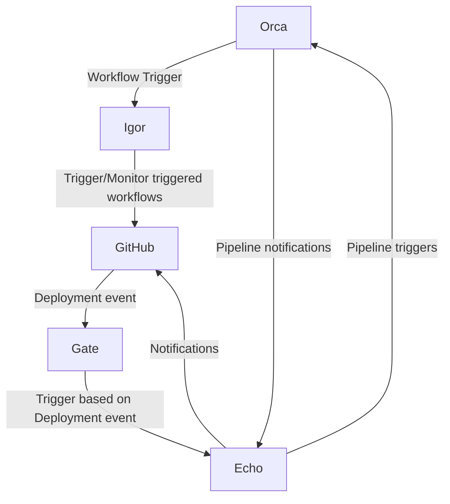
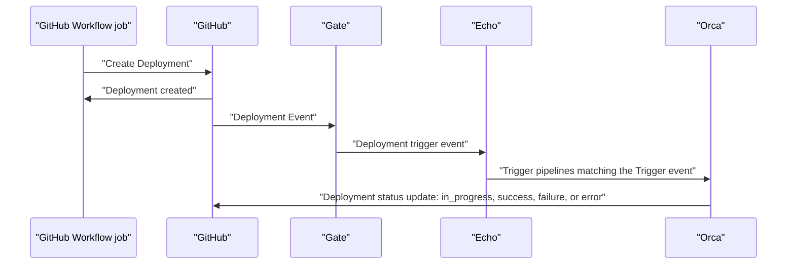

 

## GitHub Integration Plugin features

The GitHub Integration Plugin provides the following GitHub integration features:

- [Trigger a GitHub Actions workflow]() from a Spinnaker pipeline using **workflow_dispatch** or **repository_dispatch** events.
- [Trigger a Spinnaker pipeline automatically when a GitHub workflow finishes successfully]().
- [Trigger a Spinnaker pipeline when GitHub creates a new GitHub Deployment]().
- Monitor a GitHub workflow and finish pipeline execution based on the GitHub workflow result.
- [Update GitHub deployment status based on Spinnaker pipeline outcome]().
- View GitHub Action Logs in Spinnaker -- there is no need to navigate to GitHub to view the logs.
- [Validate GitHub access]() based on configuration assigned to a GitHub App account.
- [Create GitHub commit statuses]() using Echo.
- [Use AuthZ]() for your GitHub Accounts.

The GitHub Integration plugin uses [GitHub Apps](https://docs.github.com/en/apps/overview) to integrate with GitHub. GitHup Apps provide webhooks and narrow, specific permissions. You can install a GitHub App  that gives the GitHub Integration plugin access to all the repos in your GitHub organization, or you can install a Github App that gives the GitHub Integration plugin access to specific repos. You can install as many GitHub Apps as your use case requires.

## How the plugin works with GitHub

For example, the plugin processes a GitHub Deployment event like this:

## Compatibility matrix



## Installation paths

{}
{}
Use a Kustomize patch to install the plugin.

1. Create a GitHub App and install it in your repo or organization.
1. Configure the plugin with your GitHub repo(s) and/or organization(s).
1. Install the plugin using the Armory Operator.

[Instructions]()
{}

{}
Use a Kustomize patch to install the plugin.

1. Create a GitHub App and install it in your repo.
1. Configure the plugin with your GitHub repo(s) and/or organization(s).
1. Install the plugin using the Spinnaker Operator.

[Instructions]()
{}

{}
Use Spinnaker local config files to install the plugin.

1. Create a GitHub App and install it in your repo.
1. Configure the plugin with your GitHub repo(s) and/or organization(s).
1. Install the plugin in local config files and apply those changes using Halyard.

[Instructions]()
{}
{}
