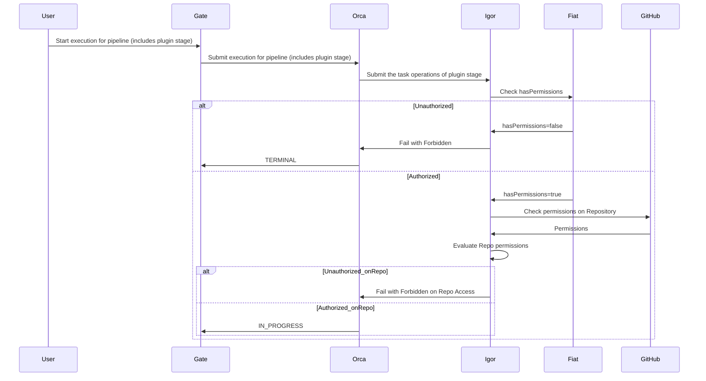

 

## Validate GitHub access

This feature validates GitHub access based on configuration assigned to a GitHub App account.

Using the `impersonateGitHubTeam` feature, you can validate and enforce GitHub App account access to repositories based on the GitHub team's assigned configuration.

### How this feature works

Before performing any action in a pipeline stage, the plugin validates that the GitHub teams configured using the `impersonateGitHubTeam` feature are assigned with one of the following roles in GitHub:

- `Admin`: Full access to the repository
- `Write`: Read and write access to the repository
- `Maintain`: Read and write access to the repository, including managing issues and pull requests

If the GitHub team does not have appropriate access to the repository, the pipeline stage fails with an error message.

### How to enable

You enable the `impersonateGitHubTeam` feature per GitHub App account by setting the `impersonateGitHubTeam` block in the `github-integration-plugin.yml` file. For example:


github:
  plugin:
    accounts:
      - name: FirstAppRepo
        organization:  company-public
        repository: first-app-repo
        defaultBranch: master
        githubAppId: 9753
        githubAppPrivateKey: encrypted:k8s!n:spin-secrets!k:github-app-9753-privatekey
        permissions:
          READ: 
            - "read-only-role"
            - "dev-role"
            - "ops-role"
          EXECUTE:
            - "dev-role"
            - "ops-role"
        impersonateGitHubTeam: []
      - name: SecondAppRepo
        organization:  company-public
        repository: second-app-repo
        defaultBranch: main
        githubAppId: 9753
        githubAppPrivateKey: encrypted:k8s!n:spin-secrets!k:github-app-9753-privatekey
        permissions: []
        impersonateGitHubTeam:
          - "dev-github-team"
          - "ops-github-team"
      - name: CompanyPrivateOrgAllRepos
        organization: company-private
        orgWideInstallation: true
        includePublicRepositories: false
        defaultBranch: main
        githubAppId: 1357
        githubAppPrivateKey: encrypted:k8s!n:spin-secrets!k:github-app-1357-privatekey
        impersonateGitHubTeam:
          - "admin-github-team"
        permissions:
          READ:
            - "read-only-role"
            - "ops-role"
          EXECUTE:
            - "ops-role"
