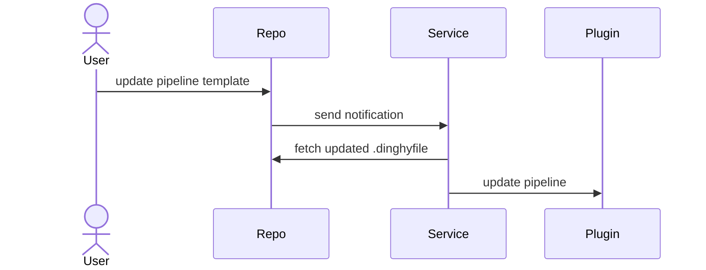

## Components

WHAT DOES A SECURITY DEPARTMENT NEED TO KNOW TO AUTHORIZE INSTALLATION? 

The Pipelines-as-Code feature has the following components:

1. Service
  * keeps your repo pipeline definitions in sync with the corresponding pipelines in Spinnaker
  * Called `dinghy` in config files
  * Communicates with repos over SSL or TLS
  
  
  ; formerly called Dinghy @TODO HOW DOES THE SERVICE COMMUNICATE WITH THE REPOS? 
SSL
even triggered in repo
configured to send to Gate via SSL

Gate receives the notification, forwards to Echo, 

1. Plugin: extends Gate and Echo by adding endpoints that the service uses

 - WHAT FUNCTIONALITY DOES THE PLUGIN PROVIDE?
* GATE -> inbound traffic has to go thru gate (external)
* ECHO -> event router
the plugin adds endpoints that the service needs to function

CDSH install - Armory Operator/Kustomize install both service and plugin??

Spinnaker - plugin (Spinnaker Operator, local config, Halyard); install service using Halyard - what if I'm using the Spinnaker Operator and don't want to install Halyard?

WHAT DATABASE? COMMENT IN SPLAT-533 "first section around SQL is deprecated" - or maybe just the Early Access part; so if I am installing in Spinnaker and need to configure a database, that config into goes into the local config 

Dinghy works out of the box with in-cluster Redis. All others must configure.

## How Pipelines-as-Code works

 

1. Your repo sends webhooks when you modify either the Templates or the Module definitions.
1. The Pipelines-as-Code service looks for and fetches all dependent modules and parses the template. Then the service updates the pipelines in Spinnaker.
1. The pipelines are automatically updated whenever a module that is used by a pipeline is updated in the version control system. This is done by maintaining a dependency graph. The Pipelines-as-Code service looks for a `dinghyfile` in all directories, not just the root path. The only exception is when you have modules in a local setting. In this case, you must update the `dinghyfile` in order to pull new updates from modules it is using.  
1. Dinghy processes changes found in a specific branch. By default, this branch is `master`. If you are using a repo that uses a different branch for the base branch, an administrator must configure the service to track that branch. For more information, see [Custom branches]().

