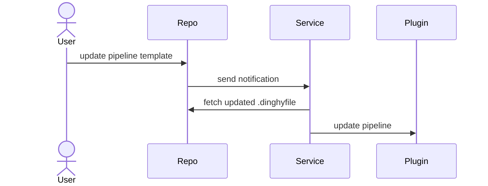

## Components

The Pipelines-as-Code feature has the following components:

1. Service (_Dinghy_):

   * Keeps your repo pipeline definitions in sync with the corresponding pipelines in Spinnaker
   * Communicates with repos over SSL or TLS  
1. Plugin: extends Gate and Echo by adding endpoints that the Dinghy service uses

## Database

Dinghy works out-of-the-box with in-cluster Redis. You can configure Pipelines-as-Code to use an external Redis or a MySQL database.

## How Pipelines-as-Code works

 

1. Your repo sends webhooks when you modify either the Templates or the Module definitions.
1. The Pipelines-as-Code service looks for and fetches all dependent modules and parses the template. Then the service updates the pipelines in Spinnaker.
1. The pipelines are automatically updated whenever a module that is used by a pipeline is updated in the version control system. This is done by maintaining a dependency graph. The Pipelines-as-Code service looks for a `dinghyfile` in all directories, not just the root path. The only exception is when you have modules in a local setting. In this case, you must update the `dinghyfile` in order to pull new updates from modules it is using.  
1. Dinghy processes changes found in a specific branch. By default, this branch is `master`. If you are using a repo that uses a different branch for the base branch, an administrator must configure the service to track that branch. For more information, see [Custom branches]().

