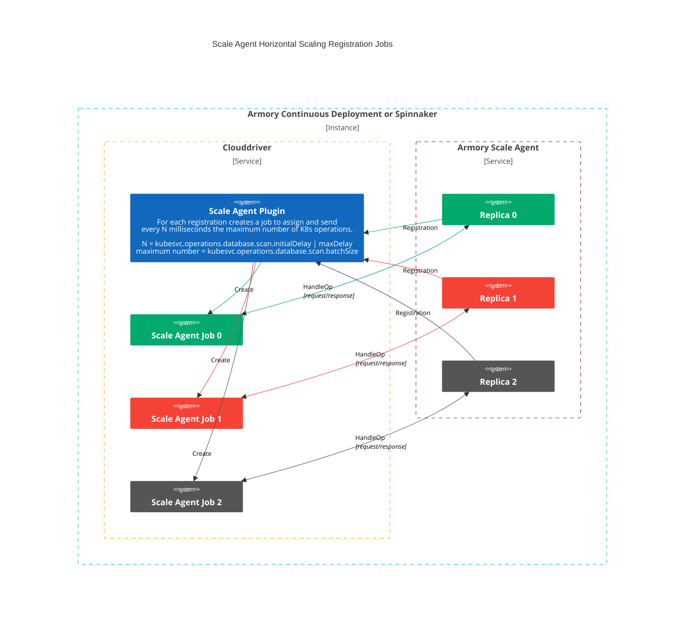
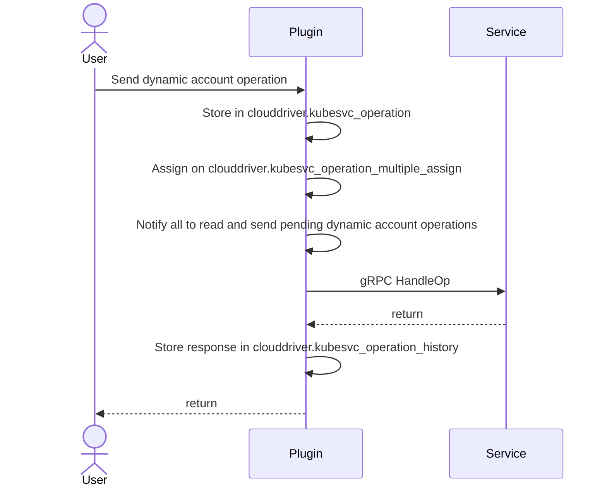

## Overview of Horizontal Scaling

Rather than sending operations to the first Scale Agent instance that could handle it, horizontal Scaling provides a way to improve operations by distributing them across all the Scale Agent replicas that could handle it.

### How to enable and use Horizontal Scaling

First, familiarize yourself with the architecture and features in this guide. Then you can:

1. 

## Horizontal Scaling glossary

- **K8s Operation**: an abstraction of a K8s operation; Get, List, Add, Delete, Patch etc.
- **Dynamic account Operation**: an abstraction of a dynamic account operation; Add or Unregister accounts
- **Endpoint**: the URL segment after the Clouddriver root
- **Request**: an instruction that isn’t fulfilled immediately and can have different outcomes; a request can be done through HTTP by the admin or internally by one of the services.

## Architecture

First is important to understand the main difference between K8s operations and Dynamic account operations.

|K8s                                                                                               |Dynamic account                                                    |
|--------------------------------------------------------------------------------------------------|-------------------------------------------------------------------|
|Are handled by a single Scale Agent Instance                                                      |Could be handled by more than one Scale Agent Instance             |
|Are processed on every polling cycle; configured by `kubesvc.operations.database.scan` properties |Are processed on demand                                            |
|Assigning on `clouddriver.kubesvc_operation_single_assign` table                                  |Assigning on `clouddriver.kubesvc_operation_multiple_assign` table |

The Scale Agent stores K8s and Dynamic Account operations data in dedicated tables that act like a queue:
- `clouddriver.kubesvc_operation`: Has the information of new received operations
- `clouddriver.kubesvc_operation_single_assign`: Has the information of K8s operations that could be assigned just to a single Scale Agent Instance
- `clouddriver.kubesvc_operation_multiple_assign`: Has the information of dynamic account operations that could be assigned to multiple Scale Agent Instances 
- `clouddriver.kubesvc_operation_history`: Has the information of K8s and dynamic account operations responses

### K8s Operations

The Scale Agent Plugin creates a job per Scale Agent Instance registration, this job is in charge of:
1. Fetching pending K8s operations from `clouddriver.kubesvc_operation` table
2. Assigning pending K8s operations on clouddriver.kubesvc_operation_single_assign table
3. Fetch assigned K8s operations from `clouddriver.kubesvc_operation_single_assign` table and send it to Scale Agent 

Some important thing to know about it, is that when getting a bad operation response and there is still time to do a retry (based on `kubesvc.cache.operationWaitMs` property), the Scale Agent Plugin does the following:
The Scale Agent Plugin does: 
1. Stored the response on `clouddriver.kubesvc_operation_history` table
2. Unassigns the operation from `clouddriver.kubesvc_operation_single_assign` table, so that another or the same Scale Agent instance can take it again

### Dynamic account Operations

Since dynamic account operations requests are less usual, the Scale Agent Plugin flow is as follows:

1. Receive and store the new dynamic account operation on `clouddriver.kubesvc_operation` table
2. Assign the dynamic account operation on `clouddriver.kubesvc_operation_multiple_assign` table; it could be assigned to all connected Scale Agent instance or to instances with the recived zoneId
3. Notify to all instances to fetch pending dynamic account operations from `clouddriver.kubesvc_operation_multiple_assign` table
4. Each instance reads and sends pending dynamic account operations to Scale Agent
5. Wait and send the response back

