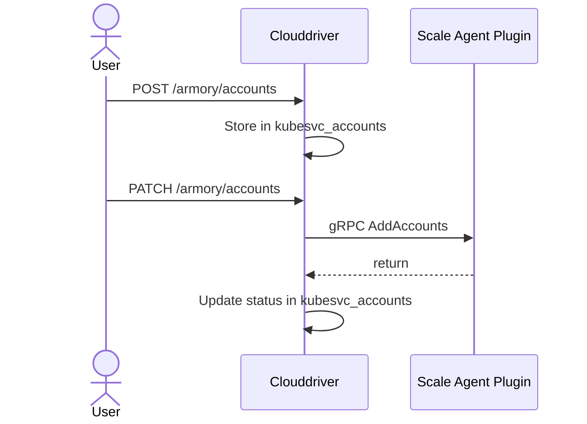

## Overview of the Dynamic Accounts feature

The Dynamic Accounts feature gives you the ability to migrate Clouddriver accounts to the Scale Agent either manually automatically by configuring. The Dynamic Accounts API provides migration and creation functionality that supports a batch encapsulation of multiple accounts containing the account definitions within. You can use the API to modify and delete existing accounts that are managed by the Scale Agent.

## Dynamic Accounts glossary

- **Endpoint**: the URL segment after the Clouddriver root
- **Migrate an account**: move a Clouddriver-managed account to the Scale Agent for management
- **Account**: an abstraction of a target cluster or target set of namespaces within a cluster
- **Credentials source**: any source from which credentials/accounts are read
- **Request**: an instruction that isn’t fulfilled immediately and can have different outcomes; a request can be done through HTTP by the admin or internally by one of the services.

## Architecture

Dynamic Accounts extends Clouddriver's Account Management [feature](https://spinnaker.io/docs/setup/other_config/accounts/), which uses a database for storing account configuration. The Scale Agent stores account data in a dedicated table called `clouddriver.kubesvc_accounts`. It does not modify or delete the account data in the `clouddriver.accounts` table.

An account has the following lifecycle states:

- Non-transient:

  - `INACTIVE`: This is the initial state. Scale Agent has provisioned the account, but the account is waiting for a migration operation.
  - `ACTIVE`: Scale Agent watches and manages the account.
  - `FAILED`: Scale Agent failed to add or delete an account.
  - `ORPHANED`: Neither Scale Agent nor Clouddriver is managing the account. It is inactive. You usually see this state when restarting or bringing down all of the replicas managing that account.

- Transient

  - `TO_MIGRATE`: The account is waiting for migration.
  - `ACTIVATING`: The account transferred to Scale Agent for activation.
  - `TO_DEACTIVATE`: Indicates there is an instruction to deactivate the account.
  - `DEACTIVATING`: A request to stop watching the account has been sent to the Scale Agent.

### Manual migration flow

Since the Scale Agent endpoints aren't directly accessible, you call them using the publicly exposed Clouddriver API `https://<clouddriver-url>:<clouddriver-port>`. 

Migration of an account is the combination of taking the snapshot from a credential source and activating it:

**What happens when you initiate a migration**

* If you do not include a `zoneId`, Clouddriver sends the request to every other Clouddriver instance that has a connected Scale Agent. Each Clouddriver instance subsequently sends the request to its Agents in an attempt to find one  that can process the request. t, this is done by trial and error.

* If the zoneId is provided** the request will be forwarded only to those clouddrivers that have an agent matching such zoneId and only to those agents the add operation will be sent.

The kubeconfig secret is decrypted in by the agent plugin and then the file content is sent as base64 as part of an attribute of the account.

It is a good practice to keep the kubeconfig with only the minimum requirements to reduce overhead.

## What happens when Agent receives the Add Account request

When receiving the set of accounts Agent will try to parse the kubeconfig and fetch the certificate information from the cluster in it. If it succeeds it will initiate a process called Discovery, which is about discovering every kubernetes kind in the target cluster for initiation of k8s-watches.

After this the old operations grpc stream is terminated a new one is created as a response to tell clouddriver which accounts are now active.

A good indicator is when all accounts become ACTIVE in the database, this can be checked by calling `/agents/kubernetes/accounts/{accountName}` on any of the accounts that were added.

## Failures and retry mechanism

Failed accounts will have a status of FAILED in kubesvc_accounts, in addition to this the reason for the failure can be obtained from the error_message column as well as the number of failures in the failed_count.

The agent plugin has an automatic retry mechanism for FAILED accounts, the max retries are 3 by default. The frequency of retry and the max retries can be changed by `kubesvc.dynamicAccounts.retryFrequencySeconds` and `kubesvc.dynamicAccounts.maxRetries`
If an account is manually patched to ACTIVE using the API the falied_count resets and the retries can start over.

## Automatic recovery of orphaned accounts

When an account has been successfully added even if the zoneId was not provided provided it will get populated with the value of the k8s Agent replicas’ zoneId that ultimately were able to process such account.

When all of the agents managing a specific account die, this account will go to an **ORPHANED** state, and on the next time the agents start the accounts will be recovered. The same happens when a new replica is scaled up for an **ACTIVE** account. That way consistency is maintained across replicas.

It can take some time for Agent when it’s restarted to process all of the accounts sent to it but it’s usually short.

## {}

* 
* 