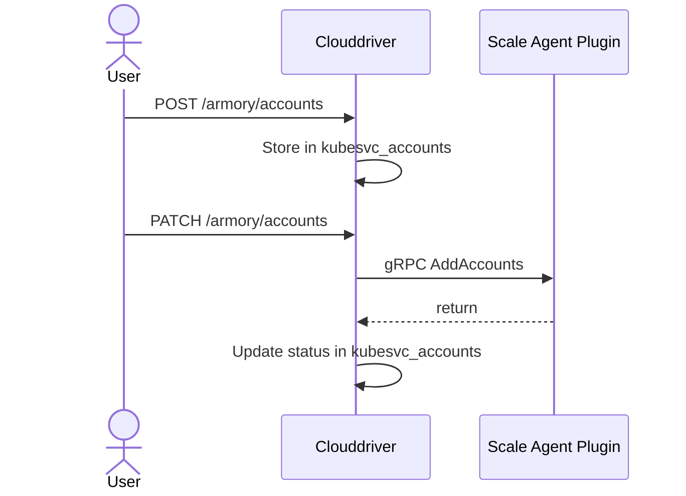

## Overview of the Dynamic Accounts API

This API gives you the ability to migrate Clouddriver accounts to the Scale Agent either manually by calling the API or configuring the . The Dynamic Accounts API provides migration and creation functionality that supports a batch encapsulation of multiple accounts containing the account definitions within. You can use the API to modify and delete existing accounts that are managed by the Scale Agent.

## Dynamic Accounts glossary

- **Endpoint**: the URL segment after the Clouddriver root
- **Migrate an account**: move a Clouddriver-managed account to the Scale Agent for management
- **Account**: an abstraction of a target cluster or target set of namespaces within a cluster
- **Credentials source**: any source from which credentials/accounts are read
- **Request**: an instruction that isn’t fulfilled immediately and can have different outcomes; a request can be done through HTTP by the admin or internally by one of the services.

## Architecture

Dynamic Accounts extends Clouddriver's Account Management [feature](https://spinnaker.io/docs/setup/other_config/accounts/), which uses a database for storing account configuration. The Scale Agent stores account data in a dedicated table called `clouddriver.kubesvc_accounts`. It does not modify or delete the account data in the `clouddriver.accounts` table.

An account has the following lifecycle states:

- Non-transient:

  - `INACTIVE`: This is the initial state. Scale Agent has provisioned the account, but the account is waiting for a migration operation.
  - `ACTIVE`: Scale Agent watches and manages the account.
  - `FAILED`: Scale Agent failed to add or delete an account.
  - `ORPHANED`: Neither Scale Agent nor Clouddriver is managing the account. It is inactive. You usually see this state when restarting or bringing down all of the replicas managing that account.

- Transient

  - `TO_MIGRATE`: The account is waiting for migration.
  - `ACTIVATING`: The account transferred to Scale Agent for activation.
  - `TO_DEACTIVATE`: Indicates there is an instruction to deactivate the account.
  - `DEACTIVATING`: A request to stop watching the account has been sent to the Scale Agent.

## {}

* 
* 