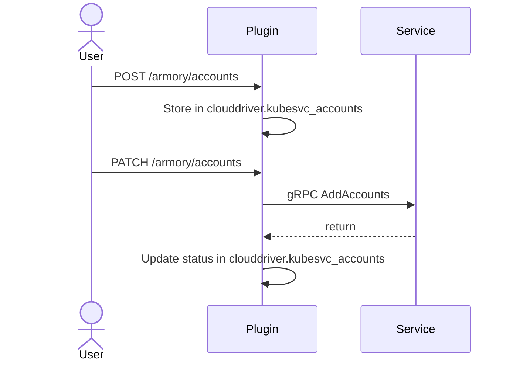
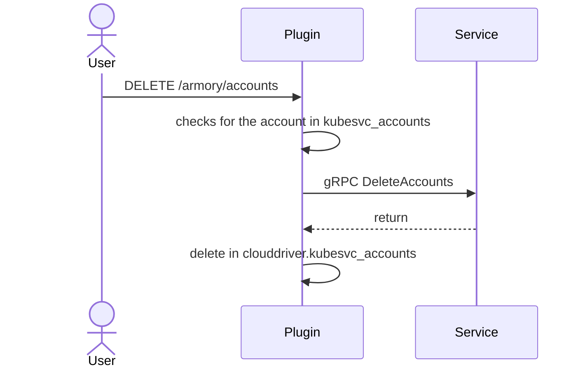

## Overview of Dynamic Accounts

Rather than [manually configure]() each Scale Agent service with the Kubernetes accounts it should manage, you can use the Dynamic Accounts feature to migrate and manage your accounts. Dynamic Accounts provides:

* Manual migration of Clouddriver Kubernetes accounts to the Scale Agent using a REST API
* Automatic migration of Clouddriver Kubernetes accounts using Clouddriver Account Management

   * Automatic migration requires Armory Continuous Deployment 2.28+ or Spinnaker 1.28+.
   * Clouddriver Account Management is not enabled by default in Spinnaker or Armory Continuous Deployment. See Spinnaker's [Clouddriver Account Management](https://spinnaker.io/docs/setup/other_config/accounts/) for how to enable this feature in your Spinnaker instance.

### REST API



### How to enable and use Dynamic Accounts

First, familiarize yourself with the architecture and features in this guide. Then you can:

1. 
1. 
1. 

## Dynamic Accounts glossary

- **Account**: an abstraction of a target cluster or target set of namespaces within a cluster
- **Credentials source**: any source from which credentials/accounts are read
- **Endpoint**: the URL segment after the Clouddriver root
- **Migrate an account**: move a Clouddriver-managed account to the Scale Agent for management
- **Request**: an instruction that isn’t fulfilled immediately and can have different outcomes; a request can be done through HTTP by the admin or internally by one of the services.

## Architecture

The Scale Agent stores account data in a dedicated table called `clouddriver.kubesvc_accounts`. It does not modify or delete the account data in the original credential source.

An account has the following lifecycle states:

- Non-transient:

  - `INACTIVE`: This is the initial state when a user adds an account. The account is waiting for a migration operation.
  - `ACTIVE`: Scale Agent watches and manages the account.
  - `FAILED`: Scale Agent failed to add or delete an account.
  - `ORPHANED`: Neither Scale Agent nor Clouddriver is managing the account. It is inactive. You usually see this state when restarting or bringing down all of the replicas managing that account.

- Transient

  - `TO_MIGRATE`: The account is waiting for migration.
  - `ACTIVATING`: The account transferred to Scale Agent for activation.
  - `TO_DEACTIVATE`: Indicates there is an instruction to deactivate the account.
  - `DEACTIVATING`: A request to stop watching the account has been sent to the Scale Agent.

### Manual migration flow

Migration of an account is the combination of taking the snapshot from a credential source and then activating the accounts.

| POST | PATCH |
|:------|:-------|
|  |    |

See  for detailed instructions and examples.

**What happens when you initiate a migration request**

* If you **do not** include a `zoneId`, the plugin sends the request to every connected Scale Agent service in an attempt to find one that can process the request.  The account's `zoneId` is updated to that of the Agent service that is able to process the add request.
* If you **do** provide a `zoneId`, the plugin forwards the request only to matching Agent services. 
* Before sending account data to the Agent service, the plugin decrypts the `kubeconfig` secret and encodes it in Base64. Then the plugin adds the encoded content as an attribute of the account. The secret data remains encoded in the database; it is not stored in plain text. 
* The plugin stores the account data in the `clouddriver.kubesvc_accounts` before sending the accounts to the relevant Scale Agent services for processing.

>To reduce overhead, create the `kubeconfig` with only the minimum requirements.

**What happens when the service receives a request to add accounts**

* After receiving the set of accounts, the Scale Agent service parses each `kubeconfig` and fetches the certificate information from the specified cluster. After the fetch succeeds, the Scale Agent service initiates a process that discovers every Kubernetes kind in the target cluster for initiation of a [Kubernetes watch](https://kubernetes.io/docs/reference/using-api/api-concepts/#efficient-detection-of-changes).
* Next, the Scale Agent service creates a new gRPC connection as a response to tell the Scale Agent plugin which accounts are now active. The plugin then updates account data in the `clouddriver.kubesvc_accounts` table.

The plugin does not inform you of the operation results due to potentially long processing time. The more accounts you send, the longer the operation takes to complete. You can check for an ACTIVE account state in the `clouddriver.kubesvc_accounts` table by querying the database directly or by calling `/agents/kubernetes/accounts/{accountName}`.

### CRUD operations

Dynamic Accounts provides endpoints for CRUD operations. The following illustrates what happens when you initiate a deletion request.

See  for detailed instructions and examples of create, read, update, and delete endpoints.

## Failures and retry mechanism

If the Scale Agent cannot add an account, it updates the account state to FAILED in the `clouddriver.kubesvc_accounts` table. You can find the reason in the `error_message` column and the number of attempts in the `failed_count` column.

The Scale Agent plugin has an automatic retry mechanism for FAILED accounts. You can configure the max retries and the frequency of retries by setting `kubesvc.dynamicAccounts.retryFrequencySeconds` (default: 5) and `kubesvc.dynamicAccounts.maxRetries` (default: 3) in the plugin configuration.

If an account is manually patched to ACTIVE using the API, the `failed_count` resets and the retries can start over.

## Automatic recovery of orphaned accounts

When all of the Scale Agent services managing a specific account die, the account goes into an ORPHANED state. The account state changes back to ACTIVE the next time the managing Scale Agent service becomes active. The same happens when a new replica is scaled up for an ACTIVE account. That way consistency is maintained across replicas.

## {}

* 
* 